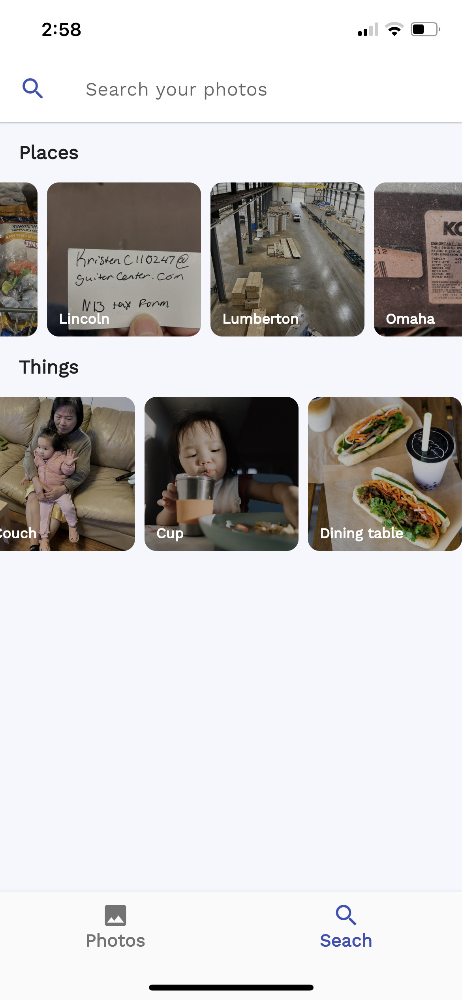

<p align="center">
  <a href="https://opensource.org/licenses/MIT"></a>
  <a href="https://github.com/alextran1502/immich"></a>
  <a href="https://immichci.little-home.net/viewType.html?buildTypeId=Immich_BuildAndroidAndGetArtifact&guest=1">
    
  </a>
  <a href="https://immichci.little-home.net/viewType.html?buildTypeId=Immich_BuildAndPublishIOSToTestFlight&guest=1">
    
  </a>
  <a href="https://actions-badge.atrox.dev/alextran1502/immich/goto?ref=main">
    
  </a>
  
  <br/>  
  <br/>  
  <br/>  
  <br/>  

  <p align="center">
    
  </p>
</p>

# Immich

Self-hosted photo and video backup solution directly from your mobile phone.


Loading ~4000 images/videos

## Screenshots

<p align="left">
  
  
  
  
  

</p>

# Note

**!! NOT READY FOR PRODUCTION! DO NOT USE TO STORE YOUR ASSETS !!**

This project is under heavy development, there will be continous functions, features and api changes.

# Features

- Upload and view assets(videos/images).
- Multi-user supported.
- Quick navigation with drag scroll bar.
- Auto Backup.
- Support HEIC/HEIF Backup.
- Extract and display EXIF info.
- Real-time render from multi-device upload event.
- Image Tagging/Classification based on ImageNet dataset
- Object detection based on COCO SSD.
- Search assets based on tags and exif data (lens, make, model, orientation)
- Upload assets from your local computer/server using [immich cli tools](https://www.npmjs.com/package/immich)
- [Optional] Reverse geocoding using Mapbox (Generous free-tier of 100,000 search/month)
- Show asset's location information on map (OpenStreetMap).
- Show curated places on the search page
- Show curated objects on the search page

# Development

You can use docker compose for development, there are several services that compose Immich

1. NestJs
2. PostgreSQL
3. Redis
4. Nginx
5. TensorFlow

## Populate .env file

Navigate to `docker` directory and run

```
cp .env.example .env
```

Then populate the value in there.

Notice that if set `ENABLE_MAPBOX` to `true`, you will have to provide `MAPBOX_KEY` for the server to run.

Pay attention to the key `UPLOAD_LOCATION`, this directory must exist and is owned by the user that run the `docker-compose` command below.

To start, run

```bash
docker-compose -f ./docker/docker-compose.yml up --build -V
```

The server will be running at `http://your-ip:2283` through `Nginx`

## Register User

Use the command below on your terminal to create user as we don't have user interface for this function yet.

```bash
curl --location --request POST 'http://your-server-ip:2283/auth/signUp' \
--header 'Content-Type: application/json' \
--data-raw '{
    "email": "testuser@email.com",
    "password": "password"
}'
```

## Run mobile app

### Android

Download `apk` in release tab and run on your phone. You can follow this guide on how to do that

- [Run APK on Android](https://www.lifewire.com/install-apk-on-android-4177185)

### iOS

You can download the app from Apple AppStore [here](https://apps.apple.com/us/app/immich/id1613945652):

<p align="left">
  
<p/>

# Support

If you like the app, find it helpful, and want to support me to offset the cost of publishing to AppStores, you can sponsor the project with [**Github Sponsore**](https://github.com/sponsors/alextran1502).

This is also a meaningful way to give me motivation and encounragment to continue working on the app.

Cheer! 🎉

# Known Issue

TensorFlow doesn't run with older CPU architecture, it requires CPU with AVX and AVX2 instruction set. If you encounter the error `illegal instruction core dump` when running the docker-compose command above, check for your CPU flags with the command and make sure you see `AVX` and `AVX2`. Otherwise, switch to a different VM/desktop with different architecture.

```bash
more /proc/cpuinfo | grep flags
```

If you are running virtualization in Promox, the VM doesn't have the flag enable.

You need to change the CPU type from `kvm64` to `host` under VMs hardware tab.

`Hardware > Processors > Edit > Advanced > Type (dropdown menu) > host`
