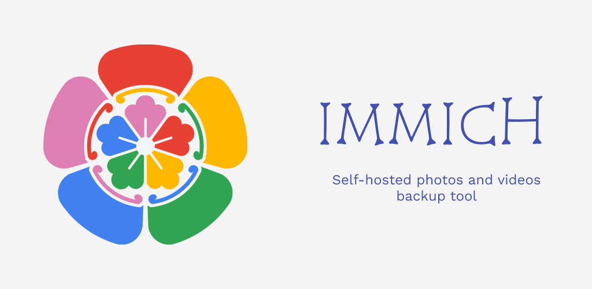
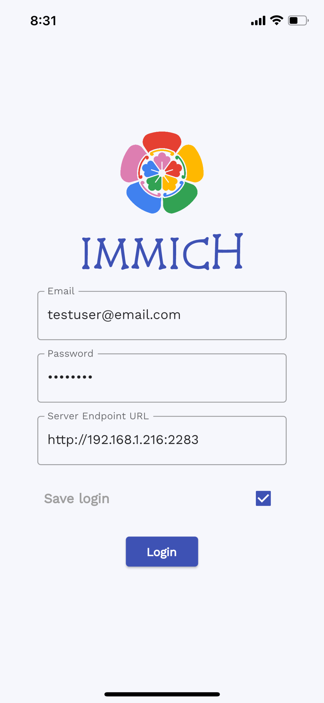
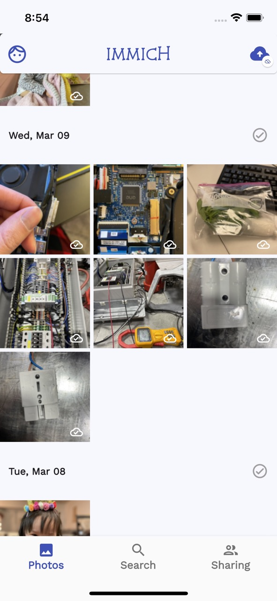
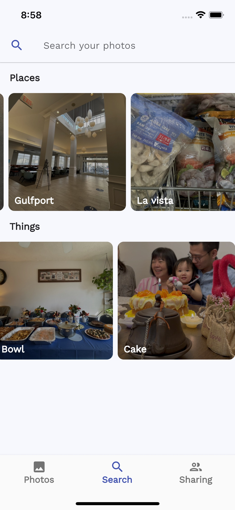
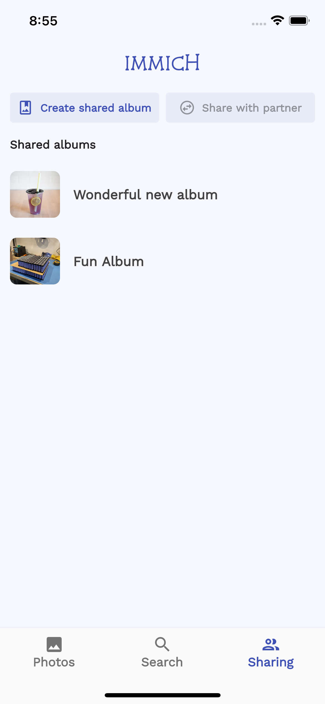
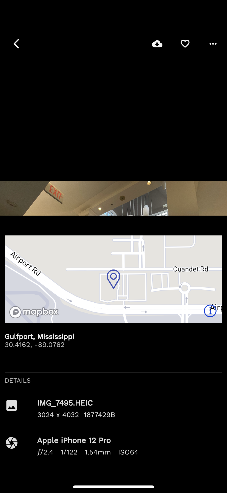
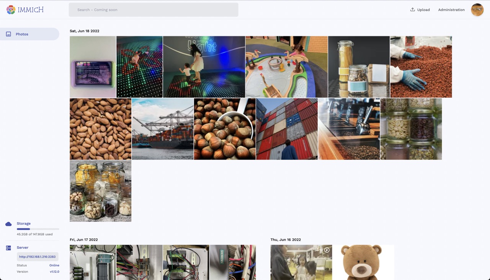
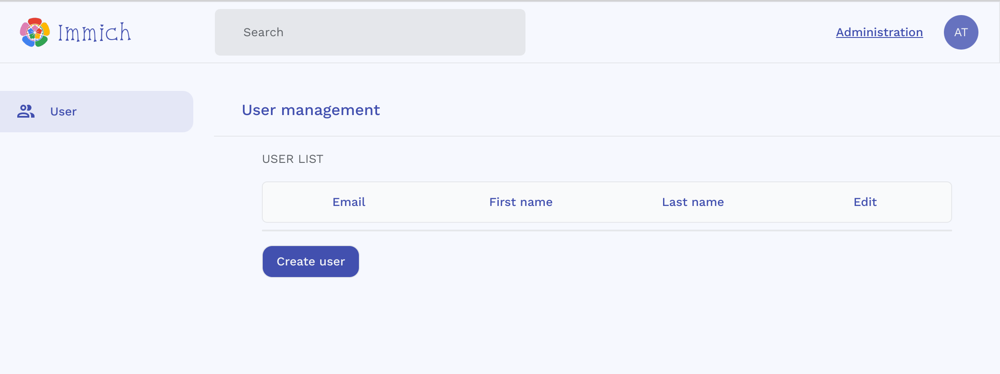
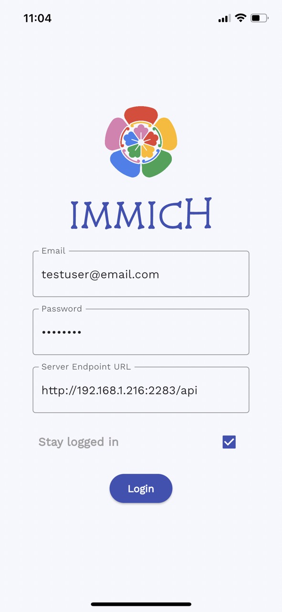
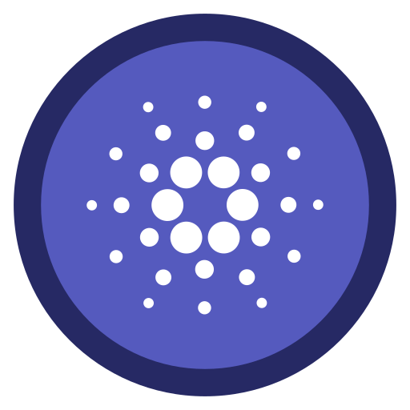

<h1 align="center"> Immich </h1>
 <p align="center"> <b>High performance self-hosted photo and video backup solution.</b> </p>
<p align="center">
  
</p>

<p align="center">
  <a href="https://opensource.org/licenses/MIT"></a>
  <a href="https://github.com/alextran1502/immich"></a>
  <a href="https://immichci.little-home.net/viewType.html?buildTypeId=Immich_BuildAndroidAndGetArtifact&guest=1">
    
  </a>
  <a href="https://immichci.little-home.net/viewType.html?buildTypeId=Immich_BuildAndPublishIOSToTestFlight&guest=1">
    
  </a>
  <a href="https://actions-badge.atrox.dev/alextran1502/immich/goto?ref=main">
    
  </a>
  <a href="https://discord.gg/D8JsnBEuKb">
    
  </a>
  <br/>  
  <br/>   
</p>

## Content
- [Features](#features)
- [Screenshots](#screenshots)
- [Installation](#installation)
- [Update](#update)
- [Mobile App](#-mobile-app)
- [Development](#development)
- [Support](#support)
- [Known Issues](#known-issues)

# Features 

> ⚠️ WARNING: **NOT READY FOR PRODUCTION! DO NOT USE TO STORE YOUR ASSETS**. This project is under heavy development, there will be continuous functions, features and api changes.

| Features | Mobile | Web |
| - | - | - | 
| Upload and view videos and photos | Yes | Yes 
| Auto backup when the app is opened | Yes | N/A
| Selective album(s) for backup | Yes | N/A
| Download photos and videos to local device | Yes | Yes
| Multi-user support | Yes | Yes
| Album | Yes | Yes
| Shared Albums | Yes | Yes
| Quick navigation with draggable scrollbar | Yes | Yes
| Support RAW (HEIC, HEIF, DNG, Apple ProRaw) | Yes | Yes
| Metadata view (EXIF, map) | Yes | Yes
| Search by metadata, objects and image tags | Yes | No
| Administrative functions (user management) | N/A | Yes
| Background backup | Android | N/A
| Virtual scroll | N/A | Yes


  <br/>  

# Screenshots

### Mobile
| | | | | |
| - | - | - | - | - |
|  <p align="center"> Login with custom URL </p> |  <p align="center"> Backup Settings </p> |  <p align="center"> Backup selection </p> |  <p align="center"> Home Screen </p> |  <p align="center"> Curated search </p> |
|  <p align="center"> Shared albums </p>  |   <p align="center"> EXIF info </p>  |  <p align="center"> Loading ~4000 images/videos </p>  |

### Web
| Home Dashboard | Image view |
| - | - |
| | |


  <br/>  

# Project Details
## 💾 System Requirements

- **OS**: Preferred unix-based operating system (Ubuntu, Debian, MacOS...etc). 

- **RAM**: At least 2GB, preferred 4GB.

- **Core**: At least 2 cores, preferred 4 cores.

## 🔩 Technology Stack

There are several services that compose Immich:

1. **NestJs** - Backend of the application
2. **SvelteKit** - Web frontend of the application
3. **PostgreSQL** - Main database of the application
4. **Redis** - For sharing websocket instance between docker instances and background tasks message queue.
5. **Nginx** - Load balancing and optimized file uploading.
6. **TensorFlow** - Object Detection (COCO SSD) and Image Classification (ImageNet).


  <br/>  

# Installation

NOTE: When using a reverse proxy in front of Immich (such as NGINX), the reverse proxy might require extra configuration to allow large files to be uploaded (such as client_max_body_size in the case of NGINX).

## Testing One-step installation (not recommended for production)

> ⚠️ *This installation method is for evaluating Immich before futher customization to meet the users' needs.*

*Applicable system: Ubuntu, Debian, MacOS*

- In the shell, from the directory of your choice, run the following command:

```bash
curl -o- https://raw.githubusercontent.com/immich-app/immich/main/install.sh | bash
```

This script will download the `docker-compose.yml` file and the `.env` file, then populate the necessary information, and finally run the `docker-compose up` or `docker compose up` (based on your docker's version) command. 

The web application will be available at `http://<machine-ip-address>:2283`, and the server URL for the mobile app will be `http://<machine-ip-address>:2283/api`.

The directory which is used to store the backup file is `./immich-app/immich-data`.


  <br/>  

## Custom installation (Recommended)

### Step 1 - Download necessary files

- Create a directory called `immich-app` and cd into it.

- Get `docker-compose.yml`

```bash
wget https://raw.githubusercontent.com/immich-app/immich/main/docker/docker-compose.yml
```

- Get `.env`

```bash
wget -O .env https://raw.githubusercontent.com/immich-app/immich/main/docker/.env.example
```

### Step 2 - Populate .env file with custom information

<a href="https://github.com/immich-app/immich/blob/main/docker/.env.example" target="_blank"><b>See the example <code>.env</code> file</b></a>

* Populate custom database information if necessary.
* Populate `UPLOAD_LOCATION` as prefered location for storing backup assets.
* Populate a secret value for `JWT_SECRET`, you can use this command: `openssl rand -base64 128`
* [Optional] Populate Mapbox value to use reverse geocoding.
* [Optional] Populate `TZ` as your timezone, default is `Etc/UTC`.

### Step 3 - Start the containers

- Run `docker-compose up` or `docker compose up` (based on your docker's version)

### Step 4 - Register admin user

- Navigate to the web at `http://<machine-ip-address>:2283` and follow the prompts to register admin user. 
<p align="center">
  
</p>

- You can add and manage users from the administration page. 
<p align="center">
 
</p>

### Step 5 - Access the mobile app

- Login the mobile app with the server endpoint URL at `http://<machine-ip-address>:2283/api`
<p align="center">
  
</p> 

  <br/>  

## Update

If you have installed, you can update the application by navigate to the directory that contains the `docker-compose.yml` file and run the following command:

```bash
docker-compose pull && docker-compose up -d
```

# Mobile app

| F-Droid | Google Play | iOS |
| - | - | - |
| <a href="https://f-droid.org/packages/app.alextran.immich"></a> | <p align="left">  <p/> | <p align="left">  <p/> |

> *The App version might be lagging behind the latest release due to the review process.*


  <br/>  

# Development

The development environment can be started from the root of the project after populating the `.env` file with the command:

```bash
make dev # required Makefile installed on the system.
``` 

All servers and web container are hot reload for quick feedback loop.

## Note for developers
### 1 - OpenAPI
OpenAPI is used to generate the client (Typescript, Dart) SDK. `openapi-generator-cli` can be installed [here](https://openapi-generator.tech/docs/installation/). When you add a new or modify an existing endpoint, you must run the generate command below to update the client SDK.

```bash
npm run api:generate # Run from server directory
```
You can find the generated client SDK in the [`web/src/api`](web/src/api) for Typescript SDK and [`mobile/openapi`](mobile/openapi) for Dart SDK.


  <br/>  

# Support

If you like the app, find it helpful, and want to support me to offset the cost of publishing to AppStores, you can sponsor the project with [**one time**](https://github.com/sponsors/alextran1502?frequency=one-time&sponsor=alextran1502) or monthly donation from [**Github Sponsor**](https://github.com/sponsors/alextran1502).

You can also donate using crypto currency with the following addresses:

<p align="" style="display: flex; place-items: center; gap: 15px" title="Bitcoin(BTC)"> <b>Bitcoin</b>: <code>1FvEp6P6NM8EZEkpGUFAN2LqJ1gxusNxZX</code></p>

<p align="" style="display: flex; place-items: center; gap: 15px" title="Cardano(ADA)">  <b>Cardano</b>: <code>addr1qyy567vqhqrr3p7vpszr5p264gw89sqcwts2z8wqy4yek87cdmy79zazyjp7tmwhkluhk3krvslkzfvg0h43tytp3f5q49nycc</code> </p>


This is also a meaningful way to give me motivation and encouragement to continue working on the app.

Cheers! 🎉


  <br/>  

# Known Issues

## TensorFlow Build Issue

*This is a known issue for incorrect Promox setup*

TensorFlow doesn't run with older CPU architecture, it requires a CPU with AVX and AVX2 instruction set. If you encounter the error `illegal instruction core dump` when running the docker-compose command above, check for your CPU flags with the command and make sure you see `AVX` and `AVX2`:
 
```bash
more /proc/cpuinfo | grep flags
``` 
  
If you are running virtualization in Promox, the VM doesn't have the flag enabled.
  
You need to change the CPU type from `kvm64` to `host` under VMs hardware tab.
  
`Hardware > Processors > Edit > Advanced > Type (dropdown menu) > host`
