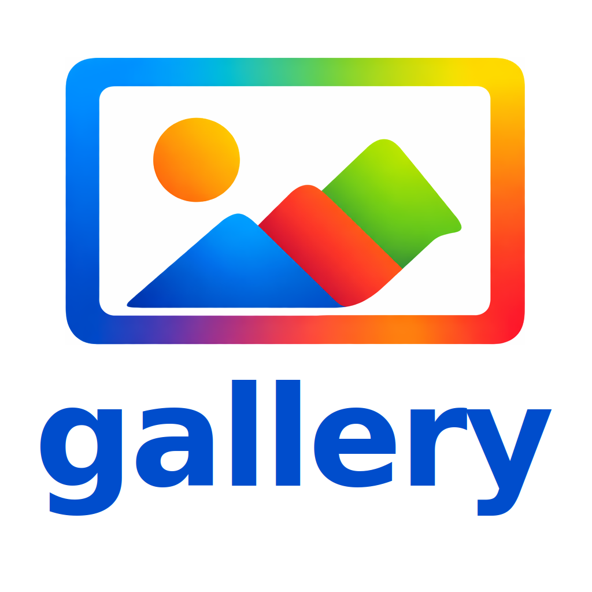

<p align="center">
  <br/>
  <a href="https://opensource.org/license/agpl-v3"></a>
  <a href="https://discord.gg/u2BSjhkv">
    
  </a>
  <br/>
  <br/>
</p>

<p align="center">
<picture>
  <source media="(prefers-color-scheme: dark)" srcset="design/gallery-logo-dark.svg">
  
</picture>
</p>
<h3 align="center">High performance self-hosted photo and video management solution</h3>
<h4 align="center"><a href="https://demo.opennoodle.de">Try the live demo</a></h4>
<br/>

> [!NOTE]
> This is a **community fork** of [Immich](https://github.com/immich-app/immich) with additional features and improvements. We regularly sync with upstream to stay up to date. See [What's Different](#whats-different-from-upstream-immich) below.

## What's Different from Upstream Immich

This fork builds on top of Immich with the following improvements:

### S3-Compatible Storage

Store your photos and videos in any S3-compatible object storage — AWS S3, MinIO, Cloudflare R2, Backblaze B2, Wasabi, and more. Configure it with a few environment variables and new uploads go straight to your bucket. Choose between `redirect` mode (clients download directly from S3 via presigned URLs) or `proxy` mode (server streams the files). Both disk and S3 backends run simultaneously, so existing files on disk continue to work. A built-in [Storage Migration](docs/docs/features/storage-migration.md) tool lets you migrate existing files between disk and S3 in either direction, with resume, rollback, and configurable concurrency. See the [S3 Storage documentation](docs/docs/features/s3-storage.md) for full setup instructions.

### Shared Spaces

Create collaborative photo-sharing spaces where multiple users can contribute and browse photos together. Unlike partner sharing (which shares your entire library one-way), Shared Spaces let you create focused groups — "Family", "Friends", "Vacation 2025" — with role-based access (Owner, Editor, Viewer). Photos are linked by reference with zero additional storage cost. Members can optionally merge space assets into their personal timeline. Spaces feature album-style collage cards, cover photos with drag-to-reposition, list and grid views, pinnable favorites, and shared face recognition so people detected across the space are browsable by all members. Full mobile parity — create, manage, and browse spaces from the Flutter app. See the [Shared Spaces documentation](docs/docs/features/shared-spaces.md) for details.

### Pet Detection

Automatically detect and tag pets in your photos using YOLO11 object detection. Detected animals appear in the People section alongside faces, making it easy to browse all your pet photos. Choose from three model sizes (nano, small, medium) depending on your accuracy vs. speed preference. Configurable from the Admin panel under Machine Learning settings. See the [Pet Detection documentation](docs/docs/features/pet-detection.md) for details.

### Google Photos Import

Import your Google Takeout archive directly from the web UI — no command-line tools needed. A guided 5-step wizard walks you through selecting your Takeout zip or folder, scanning and extracting photos, reviewing metadata, and uploading. The importer preserves original dates, GPS coordinates, descriptions, favorite and archived status, and album structure. Everything runs client-side in the browser using zip.js for extraction and the existing upload API, so no additional server configuration is required. Navigate to the `/import` page to get started.

### Image Editing Improvements

Non-destructive quick-rotate from the asset viewer toolbar, batch rotate for multiple selected images, and automatic timeline thumbnail refresh after edits. Rotations are cumulative and full 360° rotations auto-revert to the original. See the [Editing documentation](docs/docs/features/editing.mdx) for details.

### Improved Test Coverage

Server unit test coverage has been increased from **74% to 94%**, providing significantly better reliability and confidence in code changes.

### Structured JSON Logging

Added support for structured JSON log output (`IMMICH_LOG_FORMAT=json`), making it easy to integrate Immich with log aggregation systems like Grafana Loki, ELK Stack, Datadog, or Splunk.

---

## Switching to This Fork

Switching is simple — just change your Docker image names. Your existing database, configuration, and media files are fully compatible.

### Step 1: Back Up Your Database

> [!IMPORTANT]
> Always back up your database before switching. This allows you to revert to upstream Immich if needed.

```bash
docker exec -t immich_postgres pg_dumpall -c -U postgres | gzip > immich-db-backup-$(date +%Y%m%d).sql.gz
```

### Step 2: Update Your Docker Compose File

Set the version in your `.env` file:

```bash
IMMICH_VERSION=v4
```

Change the image references in your `docker-compose.yml`:

```diff
services:
  immich-server:
-   image: ghcr.io/immich-app/immich-server:${IMMICH_VERSION:-release}
+   image: ghcr.io/open-noodle/gallery-server:${IMMICH_VERSION:-release}

  immich-machine-learning:
-   image: ghcr.io/immich-app/immich-machine-learning:${IMMICH_VERSION:-release}
+   image: ghcr.io/open-noodle/gallery-ml:${IMMICH_VERSION:-release}
```

For NVIDIA GPU acceleration on the ML container, use the `-cuda` tag variant:

```yaml
image: ghcr.io/open-noodle/gallery-ml:${IMMICH_VERSION:-release}-cuda
```

### Step 3: Restart

```bash
docker compose pull
docker compose up -d
```

That's it. To switch back to upstream Immich, reverse the image names and restore your database backup.

---

<p align="center">
  <a href="readme_i18n/README_ca_ES.md">Català</a>
  <a href="readme_i18n/README_es_ES.md">Español</a>
  <a href="readme_i18n/README_fr_FR.md">Français</a>
  <a href="readme_i18n/README_it_IT.md">Italiano</a>
  <a href="readme_i18n/README_ja_JP.md">日本語</a>
  <a href="readme_i18n/README_ko_KR.md">한국어</a>
  <a href="readme_i18n/README_de_DE.md">Deutsch</a>
  <a href="readme_i18n/README_nl_NL.md">Nederlands</a>
  <a href="readme_i18n/README_tr_TR.md">Türkçe</a>
  <a href="readme_i18n/README_zh_CN.md">简体中文</a>
  <a href="readme_i18n/README_zh_TW.md">正體中文</a>
  <a href="readme_i18n/README_uk_UA.md">Українська</a>
  <a href="readme_i18n/README_ru_RU.md">Русский</a>
  <a href="readme_i18n/README_pt_BR.md">Português Brasileiro</a>
  <a href="readme_i18n/README_sv_SE.md">Svenska</a>
  <a href="readme_i18n/README_ar_JO.md">العربية</a>
  <a href="readme_i18n/README_vi_VN.md">Tiếng Việt</a>
  <a href="readme_i18n/README_th_TH.md">ภาษาไทย</a>
</p>


> [!WARNING]
> Always follow [3-2-1](https://www.backblaze.com/blog/the-3-2-1-backup-strategy/) backup plan for your precious photos and videos!

> [!NOTE]
> You can find the main documentation, including installation guides, at https://immich.app/.

## Links

- [Documentation](https://docs.immich.app/)
- [About](https://docs.immich.app/overview/introduction)
- [Installation](https://docs.immich.app/install/requirements)
- [Roadmap](https://immich.app/roadmap)
- [Features](#features)
- [Translations](https://docs.immich.app/developer/translations)
- [Contributing](https://docs.immich.app/overview/support-the-project)

## Features

| Features                                     | Mobile | Web |
| :------------------------------------------- | ------ | --- |
| Upload and view videos and photos            | Yes    | Yes |
| Auto backup when the app is opened           | Yes    | N/A |
| Prevent duplication of assets                | Yes    | Yes |
| Selective album(s) for backup                | Yes    | N/A |
| Download photos and videos to local device   | Yes    | Yes |
| Multi-user support                           | Yes    | Yes |
| Album and Shared albums                      | Yes    | Yes |
| Scrubbable/draggable scrollbar               | Yes    | Yes |
| Support raw formats                          | Yes    | Yes |
| Metadata view (EXIF, map)                    | Yes    | Yes |
| Search by metadata, objects, faces, and CLIP | Yes    | Yes |
| Administrative functions (user management)   | No     | Yes |
| Background backup                            | Yes    | N/A |
| Virtual scroll                               | Yes    | Yes |
| OAuth support                                | Yes    | Yes |
| API Keys                                     | N/A    | Yes |
| LivePhoto/MotionPhoto backup and playback    | Yes    | Yes |
| Support 360 degree image display             | No     | Yes |
| User-defined storage structure               | Yes    | Yes |
| Public Sharing                               | Yes    | Yes |
| Archive and Favorites                        | Yes    | Yes |
| Global Map                                   | Yes    | Yes |
| Partner Sharing                              | Yes    | Yes |
| Facial recognition and clustering            | Yes    | Yes |
| Memories (x years ago)                       | Yes    | Yes |
| Offline support                              | Yes    | No  |
| Read-only gallery                            | Yes    | Yes |
| Stacked Photos                               | Yes    | Yes |
| Tags                                         | No     | Yes |
| Folder View                                  | Yes    | Yes |
| **Shared Spaces**                            | Yes    | Yes |
| **S3-Compatible Storage**                    | Yes    | Yes |
| **Google Photos Import**                     | No     | Yes |
| **Pet Detection**                            | Yes    | Yes |
| **Non-destructive Image Editing**            | No     | Yes |

## Translations

Read more about translations [here](https://docs.immich.app/developer/translations).

<a href="https://hosted.weblate.org/engage/immich/">

</a>

## Docker Images

Pre-built Docker images are published to GitHub Container Registry (GHCR) under the `open-noodle` organization.

### Available Images

| Image | Description |
| :---- | :---------- |
| `ghcr.io/open-noodle/gallery-server` | Server + web UI + CLI (all-in-one) |
| `ghcr.io/open-noodle/gallery-ml` | Machine learning service (CPU) |
| `ghcr.io/open-noodle/gallery-ml:*-cuda` | Machine learning service (NVIDIA CUDA) |

### Tags

- **`release`** / **`release-cuda`** — most recent published build (like upstream's `release` tag)
- **`v4`** — floats to the latest v4.x.x release (set `IMMICH_VERSION=v4` to auto-update within major version)
- **`v4.2.6`** — pinned version using [semantic versioning](https://semver.org/)

### Publishing

Images are automatically built and published on every push to `main` via the **Release** GitHub Actions workflow (`.github/workflows/docker.yml`).

**How it works:**
1. Every merged PR triggers an automatic build
2. The version is computed from the latest git tag using semantic versioning:
   - `feat:` commit or `changelog:feat` PR label → **minor** bump (e.g. `v4.2.6` → `v4.3.0`)
   - `BREAKING CHANGE` in commit body → **major** bump (e.g. `v4.3.0` → `v5.0.0`)
   - Everything else (`fix:`, `docs:`, `chore:`, etc.) → **patch** bump (e.g. `v4.2.6` → `v4.2.7`)
3. Three jobs run in parallel: server, ML (CPU), and ML (CUDA)
4. Each image is tagged with the version, the major version (e.g. `v4`), and `release`
5. Git tags are created after successful builds
6. Images are pushed to GHCR using the built-in `GITHUB_TOKEN` — no extra secrets needed

**To manually publish a specific version:**

```bash
gh workflow run docker.yml --ref main -f version=v4.2.6
```

Or use the GitHub Actions UI: Actions > Release > Run workflow > enter version > Run.
