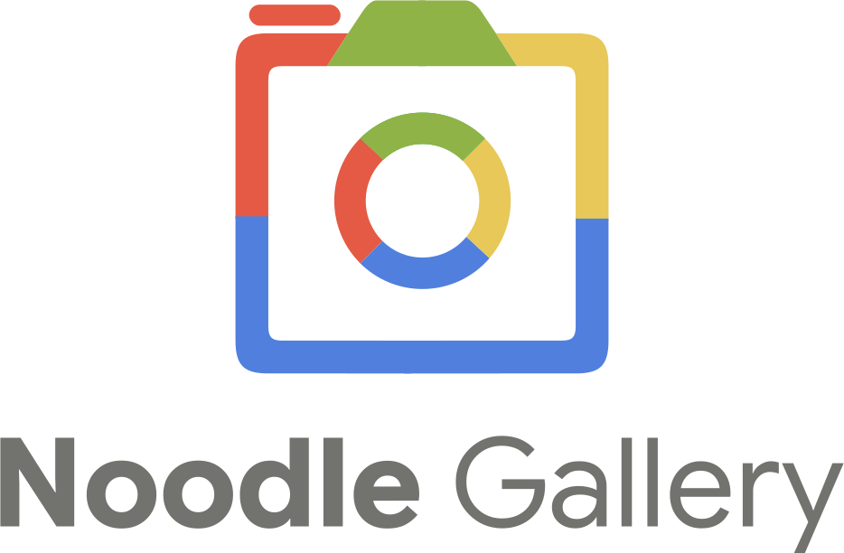

<p align="center">
  <br/>
  <a href="https://opensource.org/license/agpl-v3"></a>
  <a href="https://discord.gg/cxBfbuxyG4">
    
  </a>
  <br/>
  <br/>
</p>

<p align="center">
<picture>
  <source media="(prefers-color-scheme: dark)" srcset="design/gallery-logo-stacked-dark.svg">
  
</picture>
</p>
<h3 align="center">High performance self-hosted photo and video management solution</h3>
<h4 align="center"><a href="https://demo.opennoodle.de">Try the live demo</a></h4>
<br/>

> [!NOTE]
> This is a **community fork** of [Immich](https://github.com/immich-app/immich) with additional features and improvements. Currently based on **Immich v2.7.5**. We regularly sync with upstream to stay up to date. See [What's Different](#whats-different-from-upstream-immich) below.

> [!TIP]
> **Noodle Gallery for iPhone is now on the App Store!** Back up your photos and browse your library on the go. [Download on the App Store](https://apps.apple.com/il/app/noodle-gallery/id6761776289)

> [!TIP]
> **Already running Immich?** Switching to Gallery is a three-line config change — two image names in your `docker-compose.yml` and `IMMICH_VERSION=v4` in your `.env`. Your library, database, and mobile apps are fully compatible. See the [install guide](https://opennoodle.de/install/#migrate-from-immich).
>
> **Not for you?** A one-command [switch-back script](https://docs.opennoodle.de/guides/switch-back-to-immich) cleans up Gallery-specific tables and columns and puts you back on upstream Immich. Your photos and videos never move.

## What's Different from Upstream Immich

This fork builds on top of Immich with the following improvements:

### [Shared Spaces](https://opennoodle.de/features/shared-spaces)

Create collaborative photo-sharing spaces where multiple users can contribute and browse photos together. Unlike partner sharing (which shares your entire library one-way), Shared Spaces let you create focused groups — "Family", "Friends", "Vacation 2025" — with role-based access (Owner, Editor, Viewer). Photos are linked by reference with zero additional storage cost. Members can optionally merge space assets into their personal timeline. Spaces feature album-style collage cards, cover photos with drag-to-reposition, list and grid views, pinnable favorites, and shared face recognition so people detected across the space are browsable by all members. Full mobile parity — create, manage, and browse spaces from the Flutter app. [Feature page](https://opennoodle.de/features/shared-spaces) · [Documentation](https://docs.opennoodle.de/features/shared-spaces)

### [Smart Search & Filters](https://opennoodle.de/features/smart-search-filters)

A unified FilterPanel available on the Photos timeline, albums, Shared Spaces, and Map view. Filter by people, location, camera, tags, rating, media type, and favorites — with a temporal picker for year/month scoping. Filters are contextual: narrowing the time range automatically refreshes suggestions so you only see cameras, locations, and people that actually appear in that period. Combine filters with CLIP-powered smart search in Spaces and Map for natural language queries scoped to your filtered results. Collapsible section selector lets you show only the filter categories you care about. [Feature page](https://opennoodle.de/features/smart-search-filters) · [Spaces filtering](https://opennoodle.de/features/spaces-filtering) · [Map filtering](https://opennoodle.de/features/map-filtering) · [Documentation](https://docs.opennoodle.de/features/map-filtering)

### [User Groups](https://opennoodle.de/features/user-groups)

Create named, color-coded groups of users (e.g., "Family", "Close Friends") that you can select with one click when sharing albums or inviting to Spaces. Instead of picking people individually every time, click a group chip and all members are added at once. Groups are personal — each user manages their own. [Feature page](https://opennoodle.de/features/user-groups) · [Documentation](https://docs.opennoodle.de/features/user-groups)

### [S3-Compatible Storage](https://opennoodle.de/features/s3-storage)

Store your photos and videos in any S3-compatible object storage — AWS S3, MinIO, Cloudflare R2, Backblaze B2, Wasabi, and more. Configure it with a few environment variables and new uploads go straight to your bucket. Choose between `redirect` mode (clients download directly from S3 via presigned URLs) or `proxy` mode (server streams the files). Both disk and S3 backends run simultaneously, so existing files on disk continue to work. A built-in [Storage Migration](https://docs.opennoodle.de/features/storage-migration) tool lets you migrate existing files between disk and S3 in either direction, with resume, rollback, and configurable concurrency. [Feature page](https://opennoodle.de/features/s3-storage) · [Documentation](https://docs.opennoodle.de/features/s3-storage)

### [Search Palette](https://opennoodle.de/features/search-palette)

A keyboard-driven command palette — press <kbd>Cmd</kbd>/<kbd>Ctrl</kbd>+<kbd>K</kbd> from anywhere to search photos, people, places, and tags, and jump to any admin or settings page from one input. Five providers run in parallel and group into named sections; the Photos section toggles between Smart (CLIP), Filename, Description, and OCR matching modes via <kbd>Ctrl</kbd>+<kbd>/</kbd>. Empty sections collapse, navigation results fuzzy-match the live page catalog, and an unhealthy ML server triggers a one-tap fall back to filename mode. The palette also powers page search: submit a free-text query from Photos, Spaces, or Map to update that page's scoped search, with query recents and sort controls in the top bar. The palette surfaces context-aware verbs for the page you're on: viewing an album exposes download / rename / share / leave / delete; viewing a shared space exposes add member, manage members, add all my photos, leave, and delete. Destructive commands use an inline two-step confirm — press <kbd>Enter</kbd> once to arm, again to execute, or <kbd>Esc</kbd> to cancel — so you never lose work to a stray keypress. [Feature page](https://opennoodle.de/features/search-palette) · [Documentation](https://docs.opennoodle.de/features/search-palette)

### [Memories](https://docs.opennoodle.de/features/memories)

Server-curated memories surface meaningful photo sets automatically. Alongside classic "On this day" cards, Gallery can generate rule-based birthday memories from named people with birthdays and recent-trip memories from location patterns that differ from your usual baseline. The nightly memories task deduplicates cards, caps rule memories per day, and sends server-defined titles and subtitles to web and mobile clients. [Documentation](https://docs.opennoodle.de/features/memories)

### [Auto-Classification](https://opennoodle.de/features/auto-classification)

Define categories like "Screenshots", "Memes", or "Receipts" with text prompts, and Gallery uses CLIP AI to automatically tag and optionally archive matching photos. Each category has a tunable similarity threshold and can either tag-only or tag-and-archive. Runs on the same CLIP pipeline as smart search — no extra processing. Scan your entire existing library in seconds or let it classify new uploads automatically. Per-user categories so everyone can define their own clutter rules. [Feature page](https://opennoodle.de/features/auto-classification)

### [Video Duplicate Detection](https://opennoodle.de/features/video-duplicate-detection)

Extends upstream's photo duplicate detection to videos. Extracts multiple frames from each video, generates CLIP embeddings for each, and averages them into a single vector. This captures the visual content of the entire video, not just a single thumbnail. Uses the same deduplication UI and configurable similarity threshold as photo duplicates. [Feature page](https://opennoodle.de/features/video-duplicate-detection) · [Documentation](https://docs.opennoodle.de/features/video-duplicate-detection)

### [Pet Detection](https://opennoodle.de/features/pet-detection)

Automatically detect and tag pets in your photos using YOLO11 object detection. Detected animals appear in the People section alongside faces, making it easy to browse all your pet photos. Per-space toggle to show or hide pets. Choose from three model sizes (nano, small, medium) depending on your accuracy vs. speed preference. [Feature page](https://opennoodle.de/features/pet-detection) · [Documentation](https://docs.opennoodle.de/features/pet-detection)

### [Google Photos Import](https://opennoodle.de/features/google-photos-import)

Import your Google Takeout archive directly from the web UI — no command-line tools needed. A guided 5-step wizard walks you through selecting your Takeout zip or folder, scanning and extracting photos, reviewing metadata, and uploading. The importer preserves original dates, GPS coordinates, descriptions, favorite and archived status, and album structure, including localized Google Photos folders and newer `.supplemental-metadata.json` sidecars. Everything runs client-side in the browser using zip.js for extraction and the existing upload API, so no additional server configuration is required. [Feature page](https://opennoodle.de/features/google-photos-import) · [Documentation](https://docs.opennoodle.de/features/google-photos-import)

### [Image Editing & Video Trimming](https://opennoodle.de/features/image-editing)

Non-destructive image rotation from the asset viewer toolbar or via keyboard shortcuts (`[` / `]`), batch rotate for multiple selected images, and automatic timeline thumbnail refresh after edits. Rotations are cumulative and full 360° rotations auto-revert to the original. Video trimming lets you cut clips in the browser with a timeline scrubber — FFmpeg stream copy means instant, lossless results. Re-trim or restore the original at any time. [Feature page](https://opennoodle.de/features/image-editing) · [Video trimming](https://opennoodle.de/features/video-trimming) · [Documentation](https://docs.opennoodle.de/features/editing)

### Structured JSON Logging

Added support for structured JSON log output (`IMMICH_LOG_FORMAT=json`), making it easy to integrate with log aggregation systems like Grafana Loki, ELK Stack, Datadog, or Splunk.

---

## Switching to This Fork

Switching is simple — just change your Docker image names. Your existing database, configuration, and media files are fully compatible.

### Step 1: Back Up Your Database

> [!IMPORTANT]
> Always back up your database before switching. This allows you to revert to upstream Immich if needed.

```bash
docker exec -t immich_postgres pg_dumpall -c -U postgres | gzip > immich-db-backup-$(date +%Y%m%d).sql.gz
```

### Step 2: Update Your Docker Compose File

Set the version in your `.env` file:

```bash
IMMICH_VERSION=v4
```

Change the image references in your `docker-compose.yml`:

```diff
services:
  immich-server:
-   image: ghcr.io/immich-app/immich-server:${IMMICH_VERSION:-release}
+   image: ghcr.io/open-noodle/gallery-server:${IMMICH_VERSION:-release}

  immich-machine-learning:
-   image: ghcr.io/immich-app/immich-machine-learning:${IMMICH_VERSION:-release}
+   image: ghcr.io/open-noodle/gallery-ml:${IMMICH_VERSION:-release}
```

For NVIDIA GPU acceleration on the ML container, use the `-cuda` tag variant:

```yaml
image: ghcr.io/open-noodle/gallery-ml:${IMMICH_VERSION:-release}-cuda
```

### Step 3: Restart

```bash
docker compose pull
docker compose up -d
```

That's it. To switch back to upstream Immich later, flip the two image names back and either restore your database backup or run the [automated switch-back script](https://docs.opennoodle.de/guides/switch-back-to-immich), which drops Gallery-specific tables, columns, and migration records — shared spaces, pet detection, classifications, duplicate data — leaving a plain upstream Immich database. Your photos and videos are never touched.

---

<p align="center">
  <a href="readme_i18n/README_ca_ES.md">Català</a>
  <a href="readme_i18n/README_es_ES.md">Español</a>
  <a href="readme_i18n/README_fr_FR.md">Français</a>
  <a href="readme_i18n/README_it_IT.md">Italiano</a>
  <a href="readme_i18n/README_ja_JP.md">日本語</a>
  <a href="readme_i18n/README_ko_KR.md">한국어</a>
  <a href="readme_i18n/README_de_DE.md">Deutsch</a>
  <a href="readme_i18n/README_nl_NL.md">Nederlands</a>
  <a href="readme_i18n/README_tr_TR.md">Türkçe</a>
  <a href="readme_i18n/README_zh_CN.md">简体中文</a>
  <a href="readme_i18n/README_zh_TW.md">正體中文</a>
  <a href="readme_i18n/README_uk_UA.md">Українська</a>
  <a href="readme_i18n/README_ru_RU.md">Русский</a>
  <a href="readme_i18n/README_pt_BR.md">Português Brasileiro</a>
  <a href="readme_i18n/README_sv_SE.md">Svenska</a>
  <a href="readme_i18n/README_ar_JO.md">العربية</a>
  <a href="readme_i18n/README_vi_VN.md">Tiếng Việt</a>
  <a href="readme_i18n/README_th_TH.md">ภาษาไทย</a>
</p>

> [!WARNING]
> Always follow [3-2-1](https://www.backblaze.com/blog/the-3-2-1-backup-strategy/) backup plan for your precious photos and videos!

> [!NOTE]
> You can find the full documentation at https://docs.opennoodle.de/.

## Links

- [Website](https://opennoodle.de)
- [Documentation](https://docs.opennoodle.de/)
- [Installation](https://docs.opennoodle.de/install/requirements)
- [API Documentation](https://demo.opennoodle.de/doc) — interactive Swagger UI with all endpoints including fork-specific ones. Also available on your own instance at `/doc`
- [Roadmap](https://opennoodle.de/roadmap)
- [Features](#features)

## Features

| Features                                     | Mobile | Web |
| :------------------------------------------- | ------ | --- |
| Upload and view videos and photos            | Yes    | Yes |
| Auto backup when the app is opened           | Yes    | N/A |
| Prevent duplication of assets                | Yes    | Yes |
| Selective album(s) for backup                | Yes    | N/A |
| Download photos and videos to local device   | Yes    | Yes |
| Multi-user support                           | Yes    | Yes |
| Album and Shared albums                      | Yes    | Yes |
| Scrubbable/draggable scrollbar               | Yes    | Yes |
| Support raw formats                          | Yes    | Yes |
| Metadata view (EXIF, map)                    | Yes    | Yes |
| Search by metadata, objects, faces, and CLIP | Yes    | Yes |
| Administrative functions (user management)   | No     | Yes |
| Background backup                            | Yes    | N/A |
| Virtual scroll                               | Yes    | Yes |
| OAuth support                                | Yes    | Yes |
| API Keys                                     | N/A    | Yes |
| LivePhoto/MotionPhoto backup and playback    | Yes    | Yes |
| Support 360 degree image display             | No     | Yes |
| User-defined storage structure               | Yes    | Yes |
| Public Sharing                               | Yes    | Yes |
| Archive and Favorites                        | Yes    | Yes |
| Global Map                                   | Yes    | Yes |
| Partner Sharing                              | Yes    | Yes |
| Facial recognition and clustering            | Yes    | Yes |
| Memories (x years ago, birthdays, trips)     | Yes    | Yes |
| Offline support                              | Yes    | No  |
| Read-only gallery                            | Yes    | Yes |
| Stacked Photos                               | Yes    | Yes |
| Tags                                         | No     | Yes |
| Folder View                                  | Yes    | Yes |
| **Shared Spaces**                            | Yes    | Yes |
| **Smart Search & Filters**                   | No     | Yes |
| **Search Palette (Cmd+K)**                   | No     | Yes |
| **User Groups**                              | No     | Yes |
| **Auto-Classification**                      | No     | Yes |
| **Video Duplicate Detection**                | No     | Yes |
| **Pet Detection**                            | Yes    | Yes |
| **Google Photos Import**                     | No     | Yes |
| **Image Editing & Video Trimming**           | No     | Yes |
| **S3-Compatible Storage**                    | Yes    | Yes |

## Translations

Read more about translations [here](https://docs.immich.app/developer/translations).

<a href="https://hosted.weblate.org/engage/immich/">

</a>

## Docker Images

Pre-built Docker images are published to GitHub Container Registry (GHCR) under the `open-noodle` organization.

### Available Images

| Image                                   | Description                            |
| :-------------------------------------- | :------------------------------------- |
| `ghcr.io/open-noodle/gallery-server`    | Server + web UI + CLI (all-in-one)     |
| `ghcr.io/open-noodle/gallery-ml`        | Machine learning service (CPU)         |
| `ghcr.io/open-noodle/gallery-ml:*-cuda` | Machine learning service (NVIDIA CUDA) |

### Tags

- **`release`** / **`release-cuda`** — most recent published build (like upstream's `release` tag)
- **`v4`** — floats to the latest v4.x.x release (set `IMMICH_VERSION=v4` to auto-update within major version)
- **`v4.2.6`** — pinned version using [semantic versioning](https://semver.org/)

### Publishing

Gallery maintainers ship releases via manually-triggered GitHub Actions workflows — the full two-phase (mobile + server) flow and the server-only fast path are documented in [CONTRIBUTING.md](CONTRIBUTING.md#releases).

## Contributing

Gallery is a community fork and contributions are welcome — bug fixes, features, docs, translations. Come say hi on [Discord](https://discord.gg/cxBfbuxyG4) if you want to chat about an idea before diving in.

### Setting Up a Dev Environment

The repo is a `pnpm` workspace monorepo — server (NestJS), web (SvelteKit), mobile (Flutter), machine-learning (Python), and a few supporting packages. The dev stack runs in Docker Compose with live reload for the server and web.

**Prerequisites:** Docker, Docker Compose, Node.js 22+, and [pnpm](https://pnpm.io/installation).

1. **Fork and clone the repo**

   ```bash
   git clone https://github.com/<your-username>/gallery.git
   cd gallery
   ```

2. **Copy the example env file**

   ```bash
   cp docker/example.env docker/.env
   ```

   The defaults work out of the box for local development. Adjust `UPLOAD_LOCATION` and `DB_DATA_LOCATION` if you want to store data somewhere other than the repo directory.

3. **Install dependencies**

   ```bash
   pnpm install
   ```

   This installs deps for every workspace package (server, web, cli, sdk, e2e).

4. **Start the dev stack**

   ```bash
   make dev
   ```

   This brings up Postgres, Redis, the ML service, the server (with hot reload), and the web UI on http://localhost:2283. The first run downloads ML models and builds containers, so give it a few minutes.

### Running Tests and Checks Before You Push

```bash
# Server
cd server && pnpm test          # unit tests
cd server && pnpm check         # TypeScript type check

# Web
cd web && pnpm test             # unit tests
cd web && pnpm check            # svelte-check + tsc

# All modules from the repo root
make check-all                  # type checks everywhere
make format-all                 # prettier --write
```

CI runs lint, type checks, unit tests, and e2e tests on every PR. If you're touching server controllers or repositories, regenerate the OpenAPI clients and SQL query files:

```bash
make open-api                   # regenerates TS SDK + Dart client
make sql                        # regenerates SQL query docs (needs DB running)
```

### Opening a Pull Request

- Branch off `main` and keep PRs focused on one change.
- Follow [Conventional Commits](https://www.conventionalcommits.org/) for your commit messages (`feat:`, `fix:`, `docs:`, `chore:`, etc.) — the release workflow uses them to compute version bumps.
- Include a short description of what changed and why, plus screenshots or screen recordings for UI work.
- Make sure CI is green before requesting review.

See [CLAUDE.md](CLAUDE.md) for a deeper tour of the codebase architecture and common commands.
