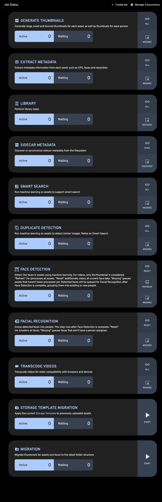

# Jobs

Several Immich functionalities are implemented as jobs, which run in the background. To view the status of a job navigate to the Administration Screen, and then the `Jobs` page.

:::info
Storage Migration job can be run after changing the [Storage Template](/docs/administration/storage-template.mdx), in order to apply the change to the existing library.
:::
