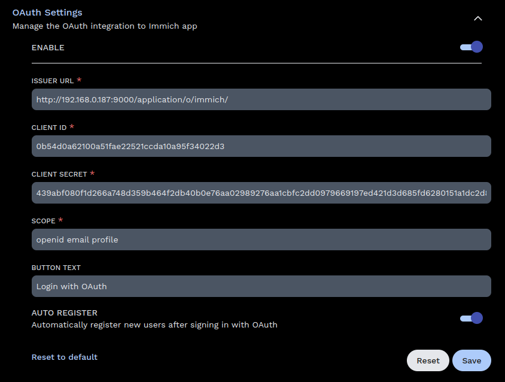

# OAuth Authentication

This page contains details about using OAuth in Immich.

:::tip
Unable to set `app.immich:/` as a valid redirect URI? See [Mobile Redirect URI](#mobile-redirect-uri) for an alternative solution.
:::

## Overview

Immich supports 3rd party authentication via [OpenID Connect][oidc] (OIDC), an identity layer built on top of OAuth2. OIDC is supported by most identity providers, including:

- [Authentik](https://goauthentik.io/integrations/sources/oauth/#openid-connect)
- [Authelia](https://www.authelia.com/configuration/identity-providers/open-id-connect/)
- [Okta](https://www.okta.com/openid-connect/)
- [Google](https://developers.google.com/identity/openid-connect/openid-connect)

## Prerequisites

Before enabling OAuth in Immich, a new client application needs to be configured in the 3rd-party authentication server. While the specifics of this setup vary from provider to provider, the general approach should be the same.

1. Create a new (Client) Application

   1. The **Provider** type should be `OpenID Connect` or `OAuth2`
   2. The **Client type** should be `Confidential`
   3. The **Application** type should be `Web`
   4. The **Grant** type should be `Authorization Code`

2. Configure Redirect URIs/Origins

   The **Sign-in redirect URIs** should include:

   - `app.immich:/` - for logging in with OAuth from the [Mobile App](/docs/features/mobile-app.mdx)
   - `http://DOMAIN:PORT/auth/login` - for logging in with OAuth from the Web Client
   - `http://DOMAIN:PORT/user-settings` - for manually linking OAuth in the Web Client

   Redirect URIs should contain all the domains you will be using to access Immich. Some examples include:

   Mobile

   - `app.immich:/` (You **MUST** include this for iOS and Android mobile apps to work properly)

   Localhost

   - `http://localhost:2283/auth/login`
   - `http://localhost:2283/user-settings`

   Local IP

   - `http://192.168.0.200:2283/auth/login`
   - `http://192.168.0.200:2283/user-settings`

   Hostname

   - `https://immich.example.com/auth/login`)
   - `https://immich.example.com/user-settings`)

## Enable OAuth

Once you have a new OAuth client application configured, Immich can be configured using the Administration Settings page, available on the web (Administration -> Settings).

| Setting                                              | Type    | Default              | Description                                                                         |
| ---------------------------------------------------- | ------- | -------------------- | ----------------------------------------------------------------------------------- |
| Enabled                                              | boolean | false                | Enable/disable OAuth                                                                |
| Issuer URL                                           | URL     | (required)           | Required. Self-discovery URL for client (from previous step)                        |
| Client ID                                            | string  | (required)           | Required. Client ID (from previous step)                                            |
| Client Secret                                        | string  | (required)           | Required. Client Secret (previous step)                                             |
| Scope                                                | string  | openid email profile | Full list of scopes to send with the request (space delimited)                      |
| Signing Algorithm                                    | string  | RS256                | The algorithm used to sign the id token (examples: RS256, HS256)                    |
| Button Text                                          | string  | Login with OAuth     | Text for the OAuth button on the web                                                |
| Auto Register                                        | boolean | true                 | When true, will automatically register a user the first time they sign in           |
| Storage Claim                                        | string  | preferred_username   | Claim mapping for the user's storage label                                          |
| [Auto Launch](#auto-launch)                          | boolean | false                | When true, will skip the login page and automatically start the OAuth login process |
| [Mobile Redirect URI Override](#mobile-redirect-uri) | URL     | (empty)              | Http(s) alternative mobile redirect URI                                             |

:::info
The Issuer URL should look something like the following, and return a valid json document.

- `https://accounts.google.com/.well-known/openid-configuration`
- `http://localhost:9000/application/o/immich/.well-known/openid-configuration`

The `.well-known/openid-configuration` part of the url is optional and will be automatically added during discovery.
:::

## Auto Launch

When Auto Launch is enabled, the login page will automatically redirect the user to the OAuth authorization url, to login with OAuth. To access the login screen again, use the browser's back button, or navigate directly to `/auth/login?autoLaunch=0`.

## Mobile Redirect URI

The redirect URI for the mobile app is `app.immich:/`, which is a [Custom Scheme](https://developer.apple.com/documentation/xcode/defining-a-custom-url-scheme-for-your-app). If this custom scheme is an invalid redirect URI for your OAuth Provider, you can work around this by doing the following:

1. Configure an http(s) endpoint to forwards requests to `app.immich:/`
2. Whitelist the new endpoint as a valid redirect URI with your provider.
3. Specify the new endpoint as the `Mobile Redirect URI Override`, in the OAuth settings.

With these steps in place, you should be able to use OAuth from the [Mobile App](/docs/features/mobile-app.mdx) without a custom scheme redirect URI.

:::info
Immich has a route (`/api/oauth/mobile-redirect`) that is already configured to forward requests to `app.immich:/`, and can be used for step 1.
:::

## Example Configuration

Here's an example of OAuth configured for Authentik:

[oidc]: https://openid.net/connect/
