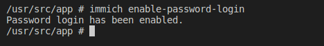
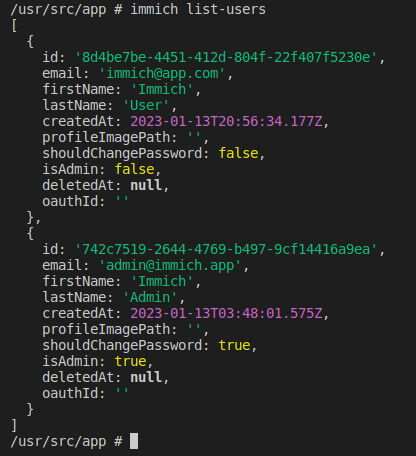

# Server Commands

The `immich-server` docker image comes preinstalled with an administrative CLI (`immich-admin`) that supports the following commands:

| Command                  | Description                           |
| ------------------------ | ------------------------------------- |
| `help`                   | Display help                          |
| `reset-admin-password`   | Reset the password for the admin user |
| `disable-password-login` | Disable password login                |
| `enable-password-login`  | Enable password login                 |
| `list-users`             | List Immich users                     |

## How to run a command

To run a command, [connect](/docs/guides/docker-help.md#attach-to-a-container) to the `immich_server` container and then execute the command via `immich <command>`.

## Examples

Reset Admin Password

Disable Password Login

Enabled Password Login

List Users

