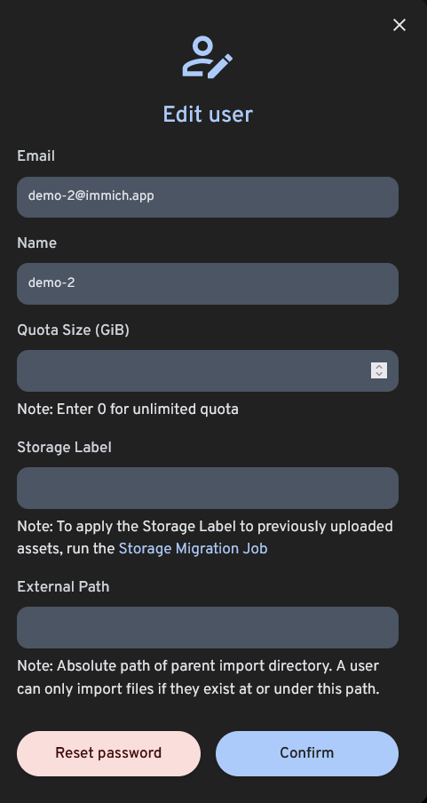

import RegisterAdminUser from '/docs/partials/_register-admin.md';
import UserCreate from '/docs/partials/_user-create.md';

# User Management

Immich supports multiple users, each with their own library.

## Register the Admin User

<RegisterAdminUser />

## Create a New User

<UserCreate />

## Set Storage Quota For User

Starting from v1.93.0, admin can specify the storage quota for the user as the instance's admin; once the limit is reached, the user won't be able to upload to the instance anymore.

In order to select a storage quota, click on the pencil icon and enter the storage quota in GiB. You can choose an unlimited quota using the value 0 (default).

:::tip
The system administrator can see the usage quota percentage of all users in Server Stats.
:::

:::info
External libraries don't take up space from the storage quota.
:::

## Delete a User

If you need to remove a user from Immich, head to "Administration", where users can be scheduled for deletion. The user account will immediately become disabled and their library and all associated data will be removed after 7 days.

## Password Reset

To reset a user's password, click the pencil icon to edit a user, then click "Reset Password". The user's password will be reset to "password" and they have to change it next time the sign in.

