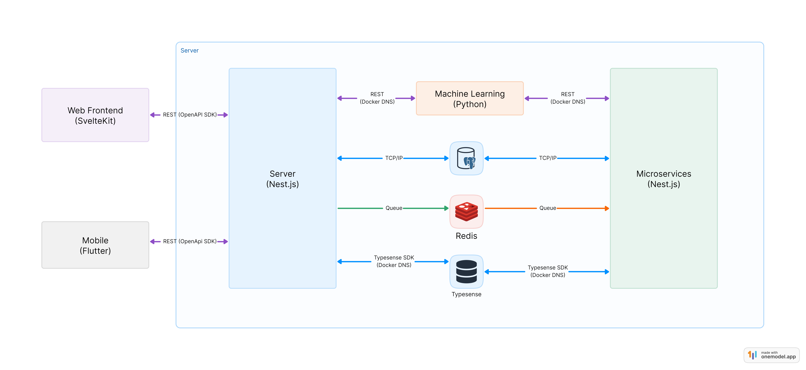

# Architecture

## High Level Diagram

## Technology

Immich is a full-stack [TypeScript](https://www.typescriptlang.org/) application, with a [Flutter](https://flutter.dev/) mobile app.

### Mobile

- [Flutter](https://flutter.dev/)
- [Riverpod](https://riverpod.dev/) for state management.

### Web

- [SvelteKit](https://kit.svelte.dev/)
- [tailwindcss](https://tailwindcss.com/)

### Server

- [Node.js](https://nodejs.org/)
- [Nest.js](https://nestjs.com/)
- [TypeORM](https://typeorm.io/) for database management.
- [Jest](https://jestjs.io/) for testing.
- [Python](https://www.python.org/) for Machine Learning.

### Database

- [PostgreSQL](https://www.postgresql.org/)
- [Redis](https://redis.io/) for job queuing.

### Web Server

- [NGINX](https://www.nginx.com/) for internal communication between containers and load balancing when scaling.
