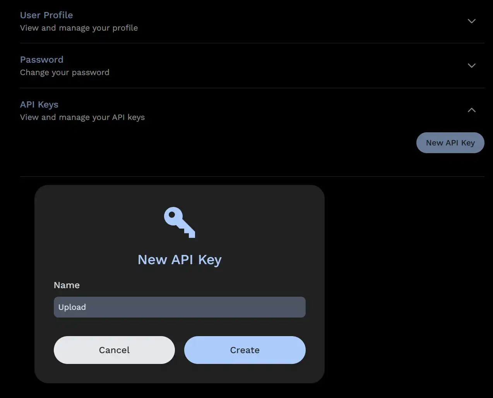

# The Immich CLI

Immich has a command line interface (CLI) that allows you to perform certain actions from the command line.

## Features

- Upload photos and videos to Immich
- Check server version
- Manage execution of background jobs

More features are planned for the future.

:::tip Google Photos Takeout
If you are looking to import your Google Photos takeout, we recommend this community maintained tool [immich-go](https://github.com/simulot/immich-go)
:::

## Requirements

- Node.js 20 or above
- Npm

If you can't install node/npm, there is also a Docker version available below.

## Installation (NPM)

```bash
npm i -g @immich/cli
```

NOTE: if you previously installed the legacy CLI, you will need to uninstall it first:

```bash
npm uninstall -g immich
```

## Installation (Docker)

If npm is not available on your system you can try the Docker version

```bash
docker run -it -v "$(pwd)":/import:ro -e IMMICH_INSTANCE_URL=https://your-immich-instance/api -e IMMICH_API_KEY=your-api-key ghcr.io/immich-app/immich-cli:latest
```

Please modify the `IMMICH_INSTANCE_URL` and `IMMICH_API_KEY` environment variables as suitable. You can also use a Docker env file to store your sensitive API key.

This `docker run` command will directly run the command `immich` inside the container. You can directly append the desired parameters (see under "usage") to the commandline like this:

```bash
docker run -it -v "$(pwd)":/import:ro -e IMMICH_INSTANCE_URL=https://your-immich-instance/api -e IMMICH_API_KEY=your-api-key ghcr.io/immich-app/immich-cli:latest upload -a -c 5 --recursive directory/
```

## Usage

<details>
<summary>Usage</summary>

```
$ immich
Usage: immich [options] [command]

Command line interface for Immich

Options:
  -V, --version                       output the version number
  -d, --config-directory <directory>  Configuration directory where auth.yml will be stored (default: "~/.config/immich/", env:
                                      IMMICH_CONFIG_DIR)
  -u, --url [url]                     Immich server URL (env: IMMICH_INSTANCE_URL)
  -k, --key [key]                     Immich API key (env: IMMICH_API_KEY)
  -h, --help                          display help for command

Commands:
  login|login-key <url> <key>         Login using an API key
  logout                              Remove stored credentials
  jobs                                Manage background jobs
  server-info                         Display server information
  upload [options] [paths...]         Upload assets
  help [command]                      display help for command
```

</details>

## Commands

### Upload
The upload command supports the following options:

<details>
<summary>Options</summary>

```
Usage: immich upload [paths...] [options]

Upload assets

Arguments:
  paths                       One or more paths to assets to be uploaded

Options:
  -r, --recursive             Recursive (default: false, env: IMMICH_RECURSIVE)
  -i, --ignore <pattern>      Pattern to ignore (env: IMMICH_IGNORE_PATHS)
  -h, --skip-hash             Don't hash files before upload (default: false, env: IMMICH_SKIP_HASH)
  -H, --include-hidden        Include hidden folders (default: false, env: IMMICH_INCLUDE_HIDDEN)
  -a, --album                 Automatically create albums based on folder name (default: false, env: IMMICH_AUTO_CREATE_ALBUM)
  -A, --album-name <name>     Add all assets to specified album (env: IMMICH_ALBUM_NAME)
  -n, --dry-run               Don't perform any actions, just show what will be done (default: false, env: IMMICH_DRY_RUN)
  -c, --concurrency <number>  Number of assets to upload at the same time (default: 4, env: IMMICH_UPLOAD_CONCURRENCY)
  -j, --json-output           Output detailed information in json format (default: false, env: IMMICH_JSON_OUTPUT)
  --delete                    Delete local assets after upload (env: IMMICH_DELETE_ASSETS)
  --no-progress               Hide progress bars (env: IMMICH_PROGRESS_BAR)
  --watch                     Watch for changes and upload automatically (default: false, env: IMMICH_WATCH_CHANGES)
  --help                      display help for command
```

</details>

Note that the above options can read from environment variables as well.

### Jobs
The jobs command supports the following options:

<details>
<summary>Options</summary>

```
Usage: immich jobs [options] [command]

Manage background jobs

Options:
  -h, --help                  display help for command

Commands:
  pause [options] <jobName>   Pause executions of all instances of the given job
  resume [options] <jobName>  Resume executions of all instances of the given job
  run [options] <jobName>     Start a specific job
  status [options] [jobName]  Get the status of all jobs or the status of a specific job
  help [command]              display help for command
```

</details>


## Quick Start

You begin by authenticating to your Immich server. For instance:

```bash
# immich login [url] [key]
immich login http://192.168.1.216:2283/api HFEJ38DNSDUEG
```

This will store your credentials in a `auth.yml` file in the configuration directory which defaults to `~/.config/immich/`. The directory can be set with the `-d` option or the environment variable `IMMICH_CONFIG_DIR`. Please keep the file secure, either by performing the logout command after you are done, or deleting it manually.

Once you are authenticated, you can upload assets to your Immich server.

```bash
immich upload file1.jpg file2.jpg
```

By default, subfolders are not included. To upload a directory including subfolder, use the --recursive option:

```bash
immich upload --recursive directory/
```

If you are unsure what will happen, you can use the `--dry-run` option to see what would happen without actually performing any actions.

```bash
immich upload --dry-run --recursive directory/
```

By default, the upload command will hash the files before uploading them. This is to avoid uploading the same file multiple times. If you are sure that the files are unique, you can skip this step by passing the `--skip-hash` option. Note that Immich always performs its own deduplication through hashing, so this is merely a performance consideration. If you have good bandwidth it might be faster to skip hashing.

```bash
immich upload --skip-hash --recursive directory/
```

You can automatically create albums based on the folder name by passing the `--album` option. This will automatically create albums for each uploaded asset based on the name of the folder they are in.

```bash
immich upload --album --recursive directory/
```

You can also choose to upload all assets to a specific album with the `--album-name` option.

```bash
immich upload --album-name "My summer holiday" --recursive directory/
```

It is possible to skip assets matching a glob pattern by passing the `--ignore` option. See [the library documentation](docs/features/libraries.md) on how to use glob patterns. You can add several exclusion patterns if needed.

```bash
immich upload --ignore **/Raw/** --recursive directory/
```

```bash
immich upload --ignore **/Raw/** **/*.tif --recursive directory/
```

By default, hidden files are skipped. If you want to include hidden files, use the `--include-hidden` option:

```bash
immich upload --include-hidden --recursive directory/
```

You can use the `--json-output` option to get a json printed which includes
three keys: `newFiles`, `duplicates` and `newAssets`. Due to some logging
output you will need to strip the first three lines of output to get the json.
For example to get a list of files that would be uploaded for further
processing:

```bash
immich upload --dry-run . | tail -n +4 | jq .newFiles[]
```

### Obtain the API Key

The API key can be obtained in the user setting panel on the web interface.



### Manage jobs via the CLI

With the Immich CLI you can also manage background jobs on your server. 
The immich jobs command allows you to pause, resume, run, or check the status of background jobs.

Once you are authenticated, you can use the `jobs` command to interact with your Immich server.

For example, you can run the following command to print out the status of all the background jobs Immich uses. 

```bash
immich jobs status
```

Additionally, you can also query the status of a specific job by providing its' name.
For example, if you want to know the status of the thumbnail generation after having imported several 
images, you can run this command:

```bash
immich jobs status thumbnailGeneration
```

You can also trigger execution of a specific job given its' name.

```bash
immich jobs run thumbnailGeneration
```

By default, this will run the thumbnail generation only on those assets that were not already processed.
If you want to run the specified job on all assets your Immich instance handles, you can use the `--refresh` option.

```bash
immich jobs run thumbnailGeneration --refresh
```

Alternatively, you can run the same command with the `--all` flag. Similarly to the `--refresh` flag, the `--all` 
may imply the deletion of the output of previous executions of that job, before running it from scratch on all assets.

```bash
immich jobs run thumbnailGeneration --all
```

If you want to stop executions of a specific job, you can run the command `pause`, followed by the job name. 
For example, to prevent generation of new thumbnails, you could run this command:

```bash
immich jobs pause thumbnailGeneration
```

To resume executions of a paused job queue, you can use the `resume` command. 
For example, to resume the generation of new thumbnails, you can run:

```bash
immich jobs resume thumbnailGeneration
```
