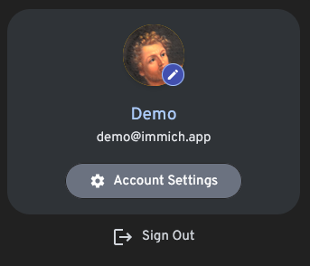
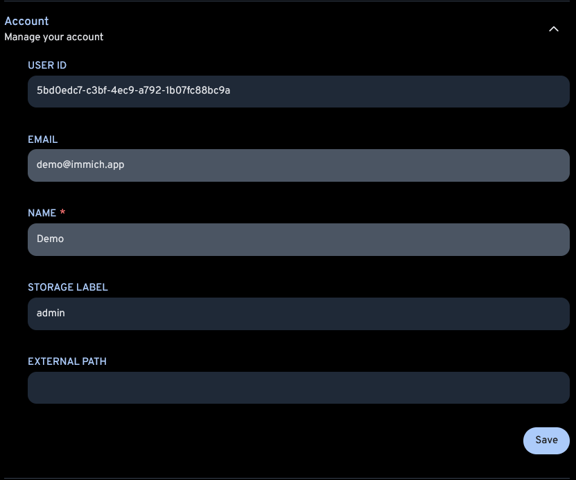
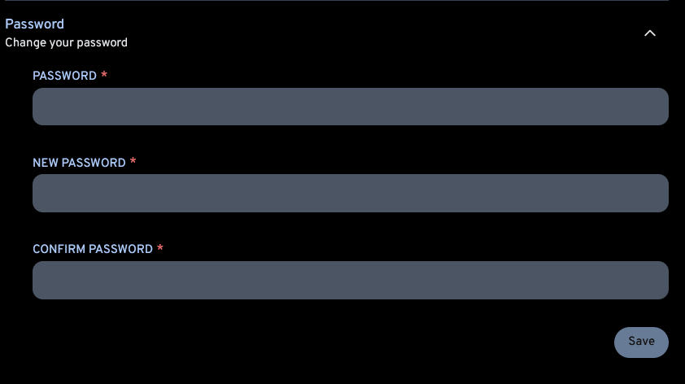

# User Settings

## User Profile

View your User ID and email, and update your first and last name.

## Change Password

Users can change their own passwords. 

:::tip Reset Password
The admin can reset a password through the [User Management](/docs/features/user-management.mdx) screen.
:::

:::tip Reset Admin Password
The admin password can be reset using a [Server Command](/docs/features/server-commands.md)
:::
