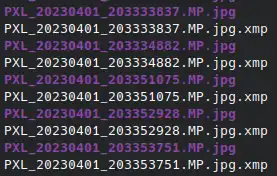

# XMP Sidecars

Immich supports XMP sidecar files — external `.xmp` files that store metadata for an image or video.  
These are commonly used by tools like Lightroom, Darktable, and digiKam to keep the original file untouched.

Immich can:
- **Read** metadata from sidecars during import
- **Write back** changes (e.g. rating, tags) to the `.xmp` file when edited in the web UI

---

## 1 · What Immich Reads

Only a few XMP fields are saved into the database:

| Stored in DB       | XMP Field                         |
|--------------------|-----------------------------------|
| **Title**          | `dc:title`                        |
| **Description**    | `dc:description`                  |
| **DateTimeOriginal** | `exif:DateTimeOriginal`        |
| **Rating**         | `xmp:Rating`                      |
| **Tags**           | `digiKam:TagsList`, `dc:subject`  |

All other fields (e.g. `Creator`, `Source`, IPTC, Lightroom edits) remain in the `.xmp` file and are **not searchable** in Immich.

---

## 2 · File Naming Rules

A sidecar must share the base name of the media file:

- ✅ `IMG_0001.jpg.xmp` ← preferred
- ✅ `IMG_0001.xmp` ← fallback
- ❌ `myphoto_meta.xmp` ← not recognized

If both `.jpg.xmp` and `.xmp` are present, Immich uses the **`.jpg.xmp`** file.

---

## 3 · How Sidecars Are Handled

### A · Imported via CLI

When uploading media via the CLI:

1. **Detect** – Immich looks for a `.xmp` file next to each media file
2. **Copy** – Both media and sidecar are copied into Immich's internal storage. The `.xmp` file is renamed to follow the same naming pattern as the media based on storage template eg. `upload/library/<user>/YYYY/YYYY-MM-DD/IMG_0001.jpg` and corresponding `upload/library/<user>/YYYY/YYYY-MM-DD/IMG_0001.jpg.xmp`
3. **Extract** – Metadata (title, description, date, rating, tags) is saved to the database
4. **Write-back** – If you later change tags, rating, etc. in the web UI, Immich updates **both** the database *and* the sidecar file

### B · External Library (Mounted Folder)

For read-only or externally mounted libraries:

1. **Detect** – The `DISCOVER` job links `.xmp` files that sit next to media (they are **not** copied)
2. **Extract** – Metadata is imported into the database
3. **Write-back** – If Immich has **write access**, sidecar files are updated with your changes  
- If the mount is **read-only**, changes only affect the database

---

## 4 · Admin Jobs

Immich provides two admin jobs for managing sidecars:

| Job       | What it does |
|-----------|--------------|
| `DISCOVER` | Finds new `.xmp` files next to media that don’t already have one linked |
| `SYNC`     | Re-reads existing `.xmp` files and refreshes metadata in the database (e.g. after external edits) |

