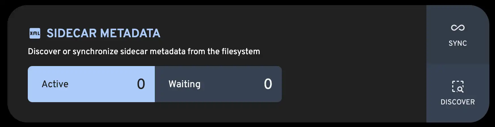

# XMP Sidecars

Immich supports XMP sidecar files — external `.xmp` files that store metadata for an image or video in XML format. During the metadata extraction job Immich will read & import metadata from `.xmp` files, and during the Sidecar Write job it will _write_ metadata back to `.xmp`.

:::tip
Tools like Lightroom, Darktable, digiKam and other applications can also be configured to write changes to `.xmp` files, in order to avoid modifying the original file.
:::

## Metadata Fields

Immich does not support _all_ metadata fields. Below is a table showing what fields Immich can _read_ and _write_. It's important to note that writes do not replace the entire file contents, but are merged together with any existing fields.

:::info
Immich automatically queues a Sidecar Write job after editing the description, rating, or updating tags.
:::

| Metadata        | Immich writes to XMP                             | Immich reads from XMP                                                                                                                                                                                                                          |
| --------------- | ------------------------------------------------ | ---------------------------------------------------------------------------------------------------------------------------------------------------------------------------------------------------------------------------------------------- |
| **Description** | `dc:description`, `tiff:ImageDescription`        | `dc:description`, `tiff:ImageDescription`                                                                                                                                                                                                      |
| **Rating**      | `xmp:Rating`                                     | `xmp:Rating`                                                                                                                                                                                                                                   |
| **DateTime**    | `exif:DateTimeOriginal`, `photoshop:DateCreated` | In prioritized order: `exif:SubSecDateTimeOriginal` `exif:DateTimeOriginal` `xmp:SubSecCreateDate` `xmp:CreateDate` `xmp:CreationDate` `xmp:MediaCreateDate` `xmp:SubSecMediaCreateDate` `xmp:DateTimeCreated` |
| **Location**    | `exif:GPSLatitude`, `exif:GPSLongitude`          | `exif:GPSLatitude`, `exif:GPSLongitude`                                                                                                                                                                                                        |
| **Tags**        | `digiKam:TagsList`                               | In prioritized order:  `digiKam:TagsList` `lr:HierarchicalSubject` `IPTC:Keywords`                                                                                                                                                 |

:::note
All other fields (e.g. `Creator`, `Source`, IPTC, Lightroom edits) remain in the `.xmp` file and are **not searchable** in Immich.
:::

## File Naming Rules

A sidecar must share the base name of the media file:

- ✅ `IMG_0001.jpg.xmp` ← preferred
- ✅ `IMG_0001.xmp` ← fallback
- ❌ `myphoto_meta.xmp` ← not recognized

If both `.jpg.xmp` and `.xmp` are present, Immich uses the **`.jpg.xmp`** file.

## CLI Support

1. **Detect** – Immich looks for a `.xmp` file placed next to each media file during upload.
2. **Copy** – Both the media and the sidecar file are copied into Immich’s internal library folder.  
   The sidecar is renamed to match the internal filename template, e.g.:  
   `upload/library/<user>/YYYY/YYYY-MM-DD/IMG_0001.jpg`  
   `upload/library/<user>/YYYY/YYYY-MM-DD/IMG_0001.jpg.xmp`
3. **Extract** – Selected metadata (title, description, date, rating, tags) is parsed from the sidecar and saved to the database.
4. **Write-back** – If you later update tags, rating, or description in the web UI, Immich will update **both** the database _and_ the copied `.xmp` file to stay in sync.

## External Library (Mounted Folder) Support

1. **Detect** – The `DISCOVER` job automatically associates `.xmp` files that sit next to existing media files in your mounted folder. No files are moved or renamed.
2. **Extract** – Immich reads and saves the same metadata fields from the sidecar to the database.
3. **Write-back** – If Immich has **write access** to the mount, any future metadata edits (e.g., rating or tags) are also written back to the original `.xmp` file on disk.

:::danger
If the mount is **read-only**, Immich cannot update either the sidecar **or** the database — **metadata edits will silently fail** with no warning see issue [#10538](https://github.com/immich-app/immich/issues/10538) for more details.
:::

## Admin Jobs

Immich provides two admin jobs for managing sidecars:

| Job        | What it does                                                                                      |
| ---------- | ------------------------------------------------------------------------------------------------- |
| `DISCOVER` | Finds new `.xmp` files next to media that don’t already have one linked                           |
| `SYNC`     | Re-reads existing `.xmp` files and refreshes metadata in the database (e.g. after external edits) |

