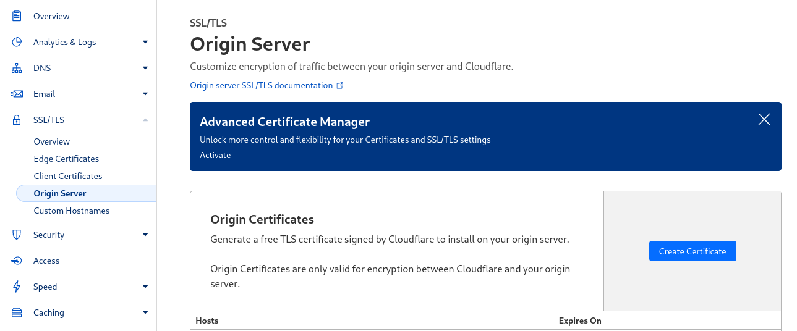
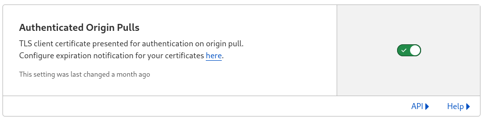
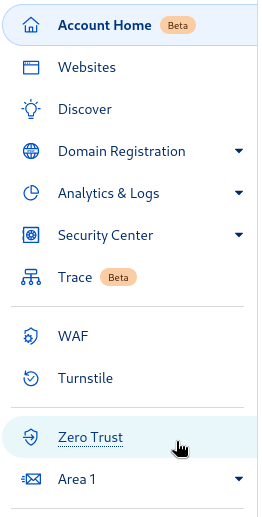
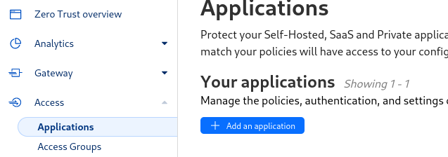
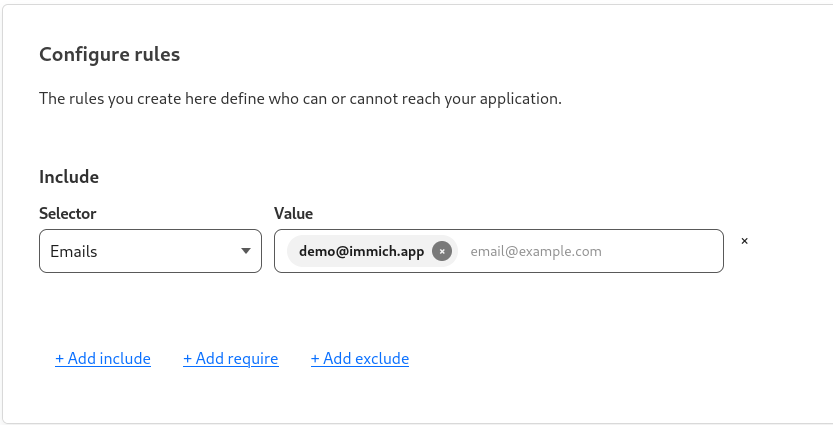
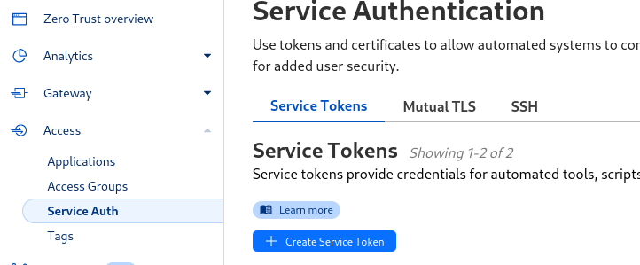

# Cloudflare Access

As discussed in [remote access](remote-access), cloudflare can be used as a reverse proxy. Cloudflare additionally provides [Cloudflare Access](https://www.cloudflare.com/en-gb/zero-trust/products/access/) which will block any requests without authentication.

The benefit of using Cloudflare (and Cloudflare Access) is that you can securely expose your Immich server on the internet and have Cloudflare act as a gatekeeper. If your Immich app was targeted in an attack, the attacker would have to go around Cloudflare first.

## Prerequisites

- Domain name
- Cloudflare (free) account
- Domain name added to your cloudflare account
- Immich server setup and running

## Security

To prevent an attacker bypassing Cloudflare, you should not accept http/https traffic from IP addresses that aren't Cloudflare. You should also validate the connection coming from Cloudflare.

You can use either or, but using both is safest.

### Limit incoming IP traffic

Using Ubuntu's UFW (uncomplicated firewall), set it up to deny all traffic by default, except for added rules.

You might want to follow this guide to [setup UFW](https://www.digitalocean.com/community/tutorials/how-to-set-up-a-firewall-with-ufw-on-ubuntu).

Create a script:

```bash
$ sudo nano /usr/bin/cloudflare_ip_update
#/bin/sh

for cfip in `curl -sw '\n' https://www.cloudflare.com/ips-v{4,6}`; do ufw allow proto tcp from $cfip to any port 443 comment 'Cloudflare IP'; done
ufw reload > /dev/null

# (press) ctrl-x and save (y key)
$ sudo chmod +x /usr/bin/cloudflare_ip_update
# run your script to add UFW rules
$ /usr/bin/cloudflare_ip_update
```

The script will download Cloudflare's IP ranges and allow HTTPs traffic from those ip addresses.

Check UFW status to see IP address ranges added

```bash
$ sudo ufw status verbose
Status: active
Logging: on (low)
Default: deny (incoming), allow (outgoing), deny (routed)
New profiles: skip

To                         Action      From
--                         ------      ----
443/tcp                    ALLOW IN    173.245.48.0/20            # Cloudflare IP
...
```

Add your the script to crontab:

```bash
$ sudo crontab -e

0 0 * * 1 /usr/bin/cloudflare_ip_update > /dev/null 2>&1
```

That will make the script run daily.

### Cloudflare Origin Server

This section will create an SSL certificate for your server. This removes the need for you to generate a publicly-trusted SSL certificate, or using a self-signed certificate that can be exploited by MITM attacks. We will use nginx here for the example config.

[Cloudflare documentation](https://developers.cloudflare.com/ssl/origin-configuration/origin-ca/)

Navigate to Cloudflare Origin Server page:



Next, create an origin certificate and copy the contents into:

- `/etc/ssl/private/cf-cert.pem` - contains the certificate
- `/etc/ssl/private/cf-cert.key` - contains the key

Snippet with SSL parameters in your nginx file (in `/etc/nginx/...`):

```bash
# default server SSL configuration
server {
  listen 443 ssl http2 default_server;
  listen [::]:443 ssl http2 default_server;
  server_name _;

  ssl_certificate /etc/ssl/private/cf-cert.pem; # <- add this
  ssl_certificate_key /etc/ssl/private/cf-cert.key; # <- add this too
  # ssl_client_certificate /etc/ssl/cf.crt;
  # ssl_verify_client on;
```

Next, reload/restart nginx (f.e. `systemctl reload nginx`), go to the Overview page (in Cloudflare) and enable Full (strict) SSL/TLS encryption mode.

### Cloudflare Authenticated Origin

This section installs Cloudflare's certificate authority certificate which Nginx will use to validate the request is really coming from cloudflare.

[Cloudflare documentation](https://developers.cloudflare.com/ssl/origin-configuration/authenticated-origin-pull/set-up).

Navigate to Cloudflare Origin Server page:


Turn on Authenticated Origin Pulls:



Add cloudflare's client certificate to `/etc/ssl/cf.crt`

You can also get this from [here](https://developers.cloudflare.com/ssl/origin-configuration/origin-ca/#cloudflare-origin-ca-root-certificate)

```
-----BEGIN CERTIFICATE-----
MIIGCjCCA/KgAwIBAgIIV5G6lVbCLmEwDQYJKoZIhvcNAQENBQAwgZAxCzAJBgNV
BAYTAlVTMRkwFwYDVQQKExBDbG91ZEZsYXJlLCBJbmMuMRQwEgYDVQQLEwtPcmln
aW4gUHVsbDEWMBQGA1UEBxMNU2FuIEZyYW5jaXNjbzETMBEGA1UECBMKQ2FsaWZv
cm5pYTEjMCEGA1UEAxMab3JpZ2luLXB1bGwuY2xvdWRmbGFyZS5uZXQwHhcNMTkx
MDEwMTg0NTAwWhcNMjkxMTAxMTcwMDAwWjCBkDELMAkGA1UEBhMCVVMxGTAXBgNV
BAoTEENsb3VkRmxhcmUsIEluYy4xFDASBgNVBAsTC09yaWdpbiBQdWxsMRYwFAYD
VQQHEw1TYW4gRnJhbmNpc2NvMRMwEQYDVQQIEwpDYWxpZm9ybmlhMSMwIQYDVQQD
ExpvcmlnaW4tcHVsbC5jbG91ZGZsYXJlLm5ldDCCAiIwDQYJKoZIhvcNAQEBBQAD
ggIPADCCAgoCggIBAN2y2zojYfl0bKfhp0AJBFeV+jQqbCw3sHmvEPwLmqDLqynI
42tZXR5y914ZB9ZrwbL/K5O46exd/LujJnV2b3dzcx5rtiQzso0xzljqbnbQT20e
ihx/WrF4OkZKydZzsdaJsWAPuplDH5P7J82q3re88jQdgE5hqjqFZ3clCG7lxoBw
hLaazm3NJJlUfzdk97ouRvnFGAuXd5cQVx8jYOOeU60sWqmMe4QHdOvpqB91bJoY
QSKVFjUgHeTpN8tNpKJfb9LIn3pun3bC9NKNHtRKMNX3Kl/sAPq7q/AlndvA2Kw3
Dkum2mHQUGdzVHqcOgea9BGjLK2h7SuX93zTWL02u799dr6Xkrad/WShHchfjjRn
aL35niJUDr02YJtPgxWObsrfOU63B8juLUphW/4BOjjJyAG5l9j1//aUGEi/sEe5
lqVv0P78QrxoxR+MMXiJwQab5FB8TG/ac6mRHgF9CmkX90uaRh+OC07XjTdfSKGR
PpM9hB2ZhLol/nf8qmoLdoD5HvODZuKu2+muKeVHXgw2/A6wM7OwrinxZiyBk5Hh
CvaADH7PZpU6z/zv5NU5HSvXiKtCzFuDu4/Zfi34RfHXeCUfHAb4KfNRXJwMsxUa
+4ZpSAX2G6RnGU5meuXpU5/V+DQJp/e69XyyY6RXDoMywaEFlIlXBqjRRA2pAgMB
AAGjZjBkMA4GA1UdDwEB/wQEAwIBBjASBgNVHRMBAf8ECDAGAQH/AgECMB0GA1Ud
DgQWBBRDWUsraYuA4REzalfNVzjann3F6zAfBgNVHSMEGDAWgBRDWUsraYuA4REz
alfNVzjann3F6zANBgkqhkiG9w0BAQ0FAAOCAgEAkQ+T9nqcSlAuW/90DeYmQOW1
QhqOor5psBEGvxbNGV2hdLJY8h6QUq48BCevcMChg/L1CkznBNI40i3/6heDn3IS
zVEwXKf34pPFCACWVMZxbQjkNRTiH8iRur9EsaNQ5oXCPJkhwg2+IFyoPAAYURoX
VcI9SCDUa45clmYHJ/XYwV1icGVI8/9b2JUqklnOTa5tugwIUi5sTfipNcJXHhgz
6BKYDl0/UP0lLKbsUETXeTGDiDpxZYIgbcFrRDDkHC6BSvdWVEiH5b9mH2BON60z
0O0j8EEKTwi9jnafVtZQXP/D8yoVowdFDjXcKkOPF/1gIh9qrFR6GdoPVgB3SkLc
5ulBqZaCHm563jsvWb/kXJnlFxW+1bsO9BDD6DweBcGdNurgmH625wBXksSdD7y/
fakk8DagjbjKShYlPEFOAqEcliwjF45eabL0t27MJV61O/jHzHL3dknXeE4BDa2j
bA+JbyJeUMtU7KMsxvx82RmhqBEJJDBCJ3scVptvhDMRrtqDBW5JShxoAOcpFQGm
iYWicn46nPDjgTU0bX1ZPpTpryXbvciVL5RkVBuyX2ntcOLDPlZWgxZCBp96x07F
AnOzKgZk4RzZPNAxCXERVxajn/FLcOhglVAKo5H0ac+AitlQ0ip55D2/mf8o72tM
fVQ6VpyjEXdiIXWUq/o=
-----END CERTIFICATE-----
```

Snippet with SSL parameters in your nginx file (in `/etc/nginx/...`):

```bash
# default server SSL configuration
server {
  listen 443 ssl http2 default_server;
  listen [::]:443 ssl http2 default_server;
  server_name _;
  ssl_certificate /etc/ssl/private/cf-cert.pem;
  ssl_certificate_key /etc/ssl/private/cf-cert.key;

  ssl_client_certificate /etc/ssl/cf.crt; # <- add this
  ssl_verify_client on;                   # <- add this
```

Finally, reload nginx and test it working. You can also try to connect to your server directly (bypassing cloudflare). Nginx should reject your request as you aren't presenting a client certificate.

## Cloudflare Access

Once all the security is in place and no-one except cloudflare can talk to your nginx, it's time to set up Cloudflare Access, which will set up a login page in front of your Nginx and won't allow traffic through unless you are authenticated.

Navigate to Zero Trust:



Navigate to Access -> Applications:



1. Click `Add an application`
1. Select `Self-hosted`
1. Configure a name, domain name and click Next
1. Add a policy name, in the Rules section add Include Email like this: 
1. Click `Next` and then `Add application`

Navigate to your Immich server, you should now be presented with a Cloudflare page requiring you to login. It will send an email to you with a Pin, which you will need to type in. Once authenticated, you will be able to access Immich.

### App access

Add a service token, select a long expiry (or not expiring).



Save the Client ID and Secret values. It will appear as something like this:

```
CF-Access-Client-Id: 12345.access
CF-Access-Client-Secret: super-secret-secret
```

In Cloudflare:

1. Go back to Applications (in zero access)
1. click Edit on your Application
1. in the `Policies` tab, click `Add Policy`
1. name the policy `service` and in `Action` choose `Service Auth`
1. under Rules, choose `Include` and `Any Access Service Token` in the dropdown
1. Save

In the Immich app:

1. open settings
1. open Advanced Settings
1. open Proxy Headers
1. Add `Cf-Access-Client-Id` as the header name and paste the value of the header (the value after the colon character). For example: for `Cf-Access-Client-Id: 12345.access`, `12345.access` is the value to paste into the header value field.
1. Add another header
1. Add `Cf-Access-Client-Secret` as the header name and paste the value of the secret
1. Navigate back to the login page, and login with your server URL.

You can reuse the same client id and secret credentials for all users of the app, they will then login individually to Immich. The client ID and secret are to authenticate cloudflare.
