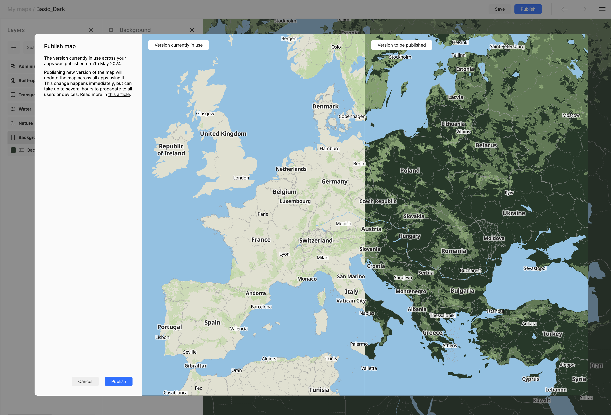

# Create Custom Map Styles for Immich Using Maptiler

You may decide that you'd like to modify the style document which is used to draw the maps in Immich. This can be done easily using Maptiler, if you do not want to write an entire JSON document by hand.

## Steps

1. Create a free account at https://cloud.maptiler.com
2. Once logged in, you can either create a brand new map by clicking on **New Map**, selecting a starter map, and then clicking **Customize**, OR by selecting a **Standard Map** and customizing it from there.
3. The **editor** interface is self-explanatory. You can change colors, remove visible layers, or add optional layers (e.g., administrative, topo, hydro, etc.) in the composer.
4. Once you have your map composed, click on **Save** at the top right. Give it a unique name to save it to your account.
5. Next, **Publish** your style using the **Publish** button at the top right. This will deploy it to production, which means it is able to be exposed over the Internet. Maptiler will present an interactive side-by-side map with the original and your changes prior to publication. 
6. Maptiler will warn you that changing the map will change it across all apps using the map. Since no apps are using the map yet, this is okay.
7. Clicking on the name of your new map at the top left will bring you to the item's **details** page. From here, copy the link to the JSON style under **Use vector style**. This link will automatically contain your personal API key to Maptiler.
8. In **Immich**, navigate to **Administration --> Settings --> Map & GPS Settings** and expand the **Map Settings** subsection.
9. Paste the link to your JSON style in either the **Light Style** or **Dark Style**. (You can add different styles which will help make the map style more appropriate depending on whether you set **Immich** to Light or Dark mode.
10. Save your selections. Reload the map, and enjoy your custom map style!
