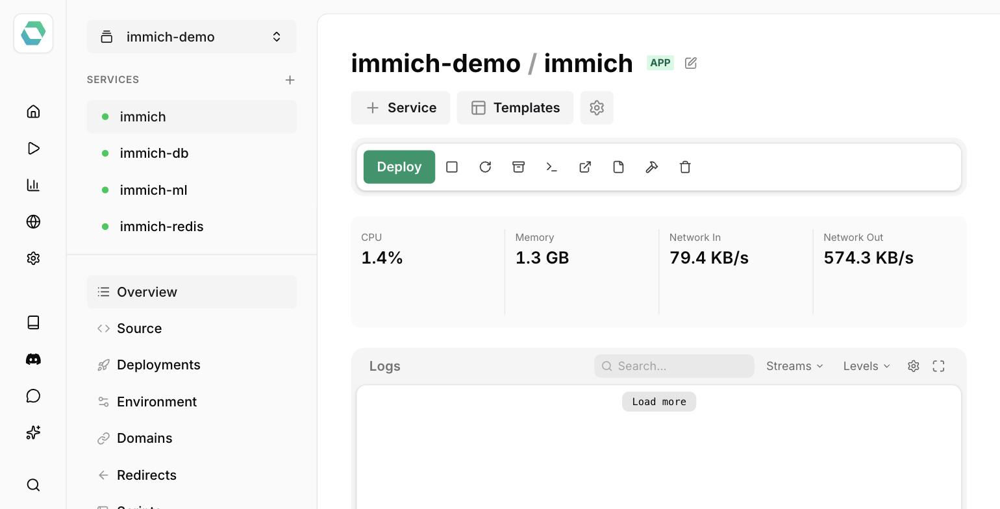

# Easypanel [ Community ]

:::note
This is a community contribution and not officially supported by the Immich team, but included here for convenience.

Community support can be found in the dedicated channel on the [Discord Server](https://discord.immich.app/).
:::

[Easypanel](https://easypanel.io) is a self-hosted Docker deployment platform, and Immich has a one-click deployment template there: https://easypanel.io/templates/immich

The template deploys the Immich server, machine learning service, PostgreSQL (with pgvecto.rs), and Redis, with persistent storage for your uploaded media set up automatically.

