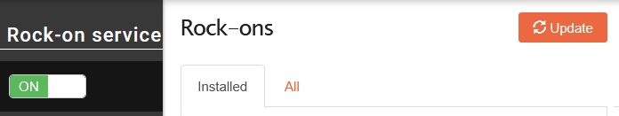
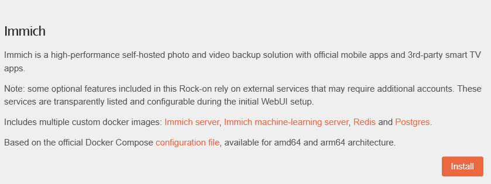
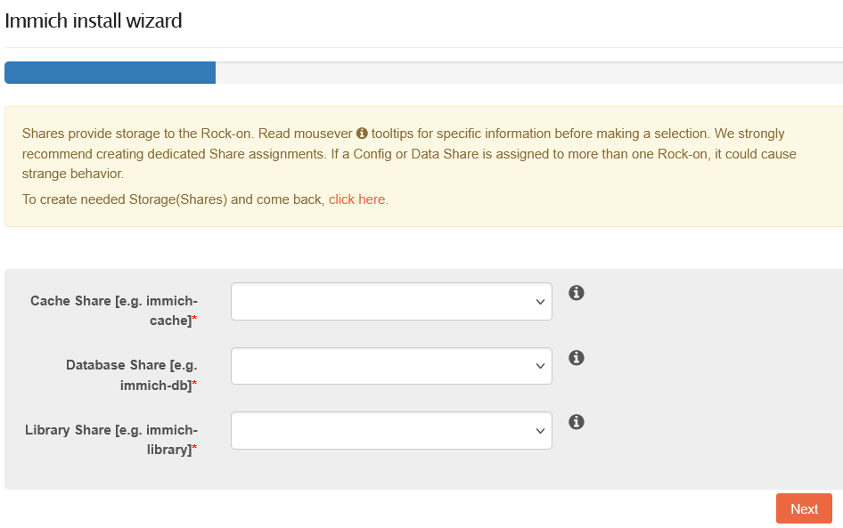
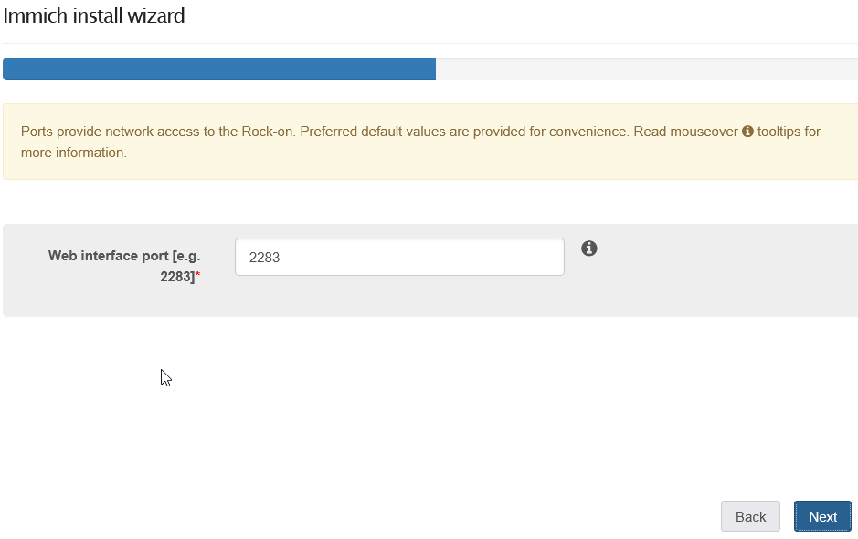
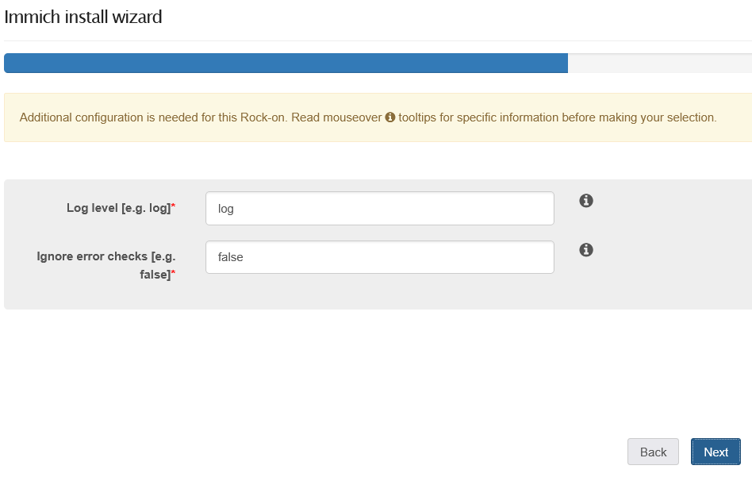
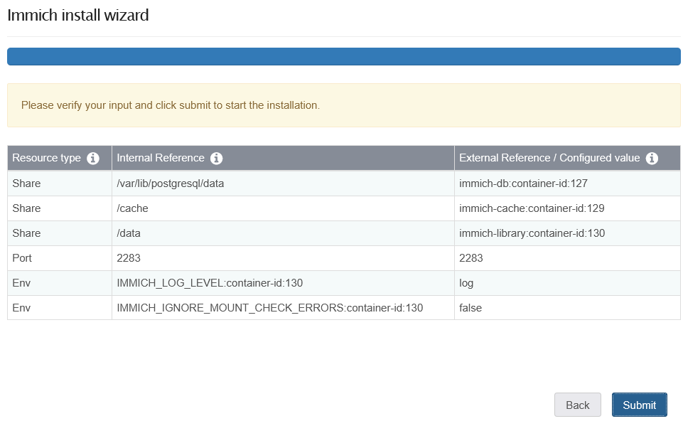
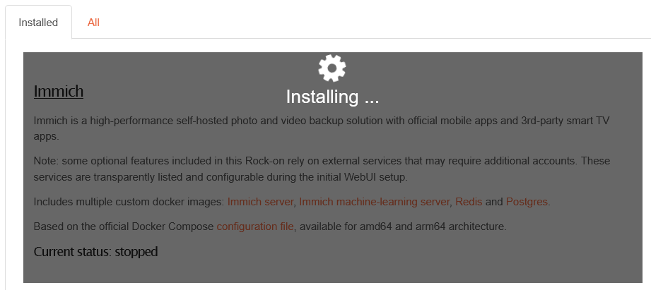
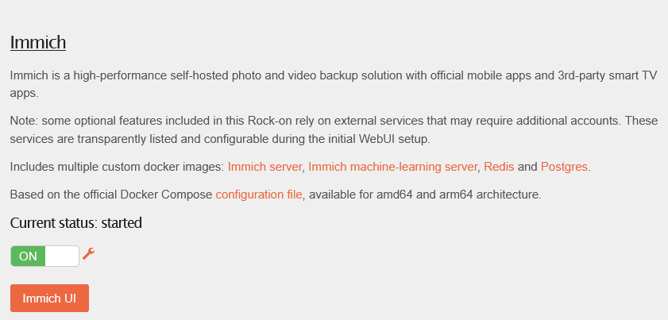
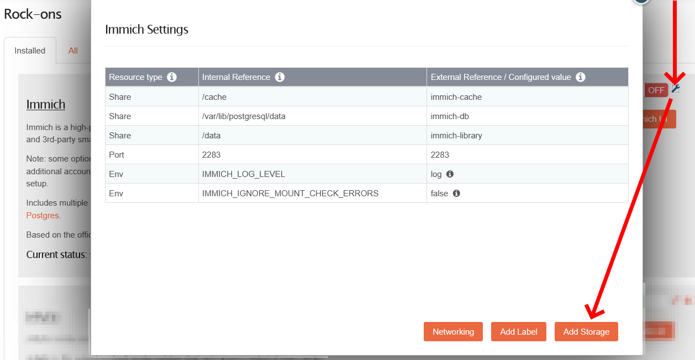
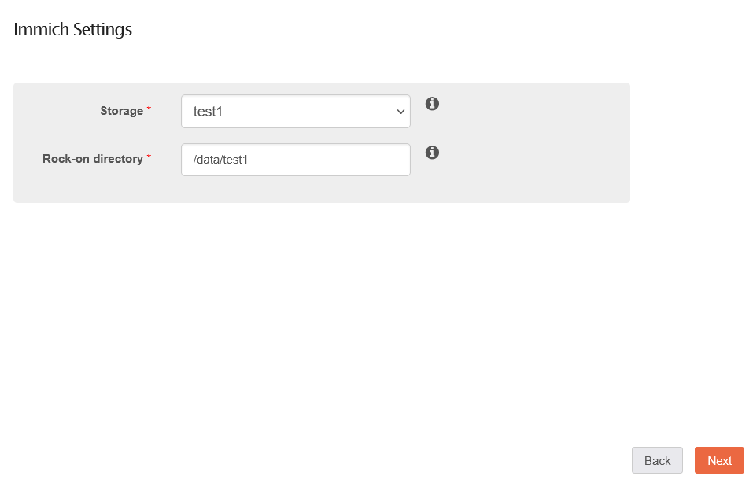

# Rockstor [Community]

:::note
This is a community contribution and not officially supported by the Immich team, but included here for convenience.

Community support can be found in the dedicated channel on the [Discord Server](https://discord.immich.app/).

**Please report app issues to the corresponding [GitHub Repository](https://github.com/rockstor/rockon-registry/issues).**
:::

Immich can be easily installed on Rockstor via the Immich Rock-on.

If you have not previously used Rock-ons, please check out the [Rock-on documentation](https://rockstor.com/docs/interface/overview.html) for information regarding the initial setup.

## Prerequisites

### Setting up Storage Shares

The Immich Rock-on requires 3 [shares to be created](https://rockstor.com/docs/interface/storage/shares-btrfs-subvolumes.html#creating-a-share) before the installation can begin:
 
 - Library share: used by Immich to store uploaded photos/videos,
 - Database share,
 - Cache share: used by Immich's machine-learning functionality

## Installing the Immich Rock-on

To install the Rock-on, click on **ROCK-ONS** in top menu.

Next, make sure the Rock-on service is on, then click on the **Update** button on the far right. This will make sure you have the latest list of available Rock-ons for you to install.

At this point, the **All** tab should activate itself. If not, please click on it.

Now find the Immich Rock-on from the list and click on the **Install** button.

The install wizard has appeared. 

In the first step, please select the 3 shares that you created previously.

Then click on **Next**.

Input a free port to access Immich with a browser after the installation.

Then click on **Next**.

**Log level**: Input the desired log level. You will want to use **log** for normal operations. Other available values: verbose, debug, warn, error.

**Ignore error checks**: Input whether you want to skip mount error checks. You will want to use **false**, unless you have [issues with your Immich instance](https://docs.immich.app/administration/system-integrity).

Then click on **Next**.

At this point you will get the summary configuration.

Then click on **Submit**.

The Rock-on will begin with the actual installation of Immich.

The **Installed** tab will be activated and the "Installing..." indicator will run until Immich is finally installed and comes online.

At this point Immich will be up-and-running. 

Click on the **Immich UI** button to open the web configuration and complete the Immich-specific set-up.

### External Libraries

:::warning Write access!

Mounting an external library of photos/videos via the Web-UI will give Immich write-access by default.

If you want to restrict Immich to read-only-access, you will need to do the following instead:
 1. download the [Immich Rock-on configuration file](https://github.com/rockstor/rockon-registry/blob/master/immich.json),
 2. save it under `/opt/rockstor/rockons-metastore/`,
 3. edit the file: toward the end of the file, right after `[ "-e", "DB_HOSTNAME=immich-database" ]`, insert the following line: `, [ "-v", "/mnt2/MyPrivatePhotoCollection:/mnt2/MyPrivatePhotoCollection:ro" ]`, where `/mnt2/MyPrivatePhotoCollection` is the path to the share where you keep your existing photos/videos,
 4. save file,
 5. in case your Immich instance is already running: go into the "ROCK-ONS" menu, find the Immich Rock-on, set it to **OFF**, afterwards click on the **Uninstall** button,
 6. now repeat all steps in chapter "Installing the Immich Rock-on".
:::

In case you already have a share full of existing photos and videos, you probably want to import them into Immich.

To make the share available to Immich, you will need to first stop the running Immich instance.

You do that by clicking on the green **ON** button (which will subsequently turn to a red **OFF** button).

Now click on the small wrench icon right next to the red **OFF** button, and click on the **Add Storage** button.

Storage: select the share that contains your existing photos/videos.

Rock-on directory: input a path under which your share will be available in the Immich instance.

Then click on **Next**.

If everything looks fine on the summary configuration page, then click on **Next** again, and then **Submit**.

After Immich will be up-and-running again, go into your admin **External Libraries** configuration page in Immich, and add the supplied path (i.e. `/data/test1`).
