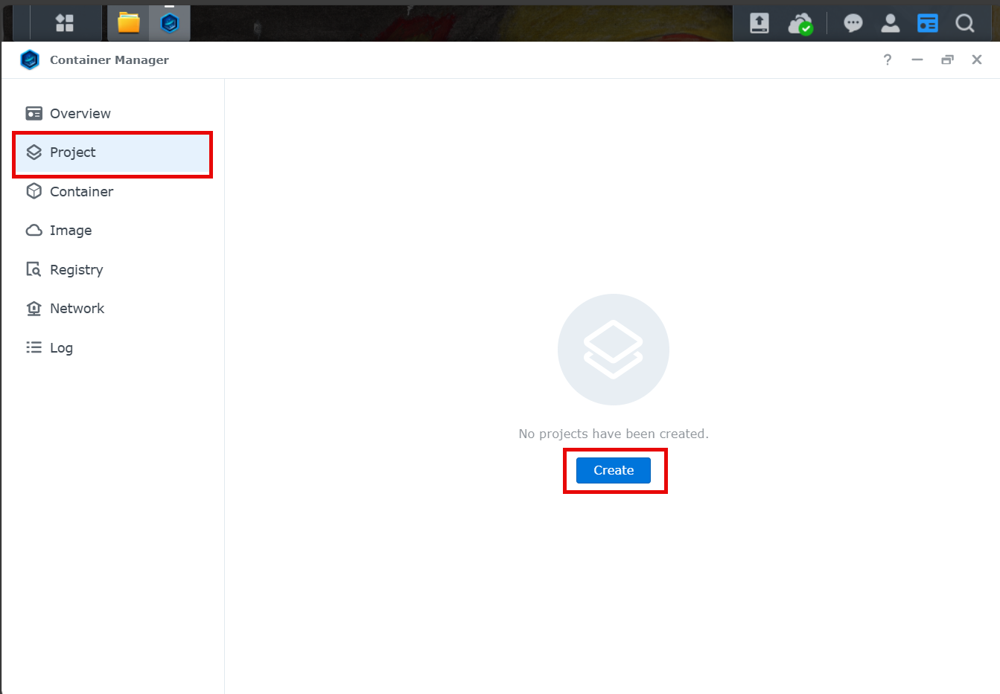
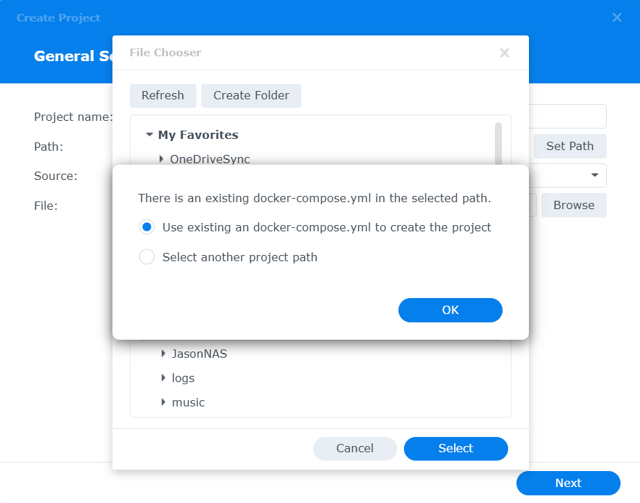
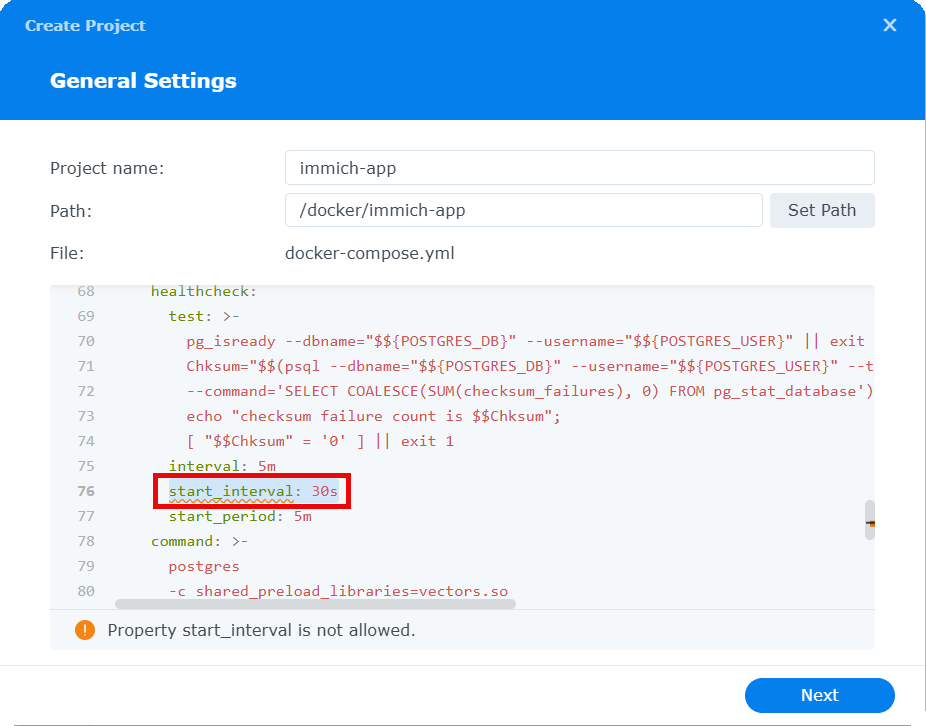
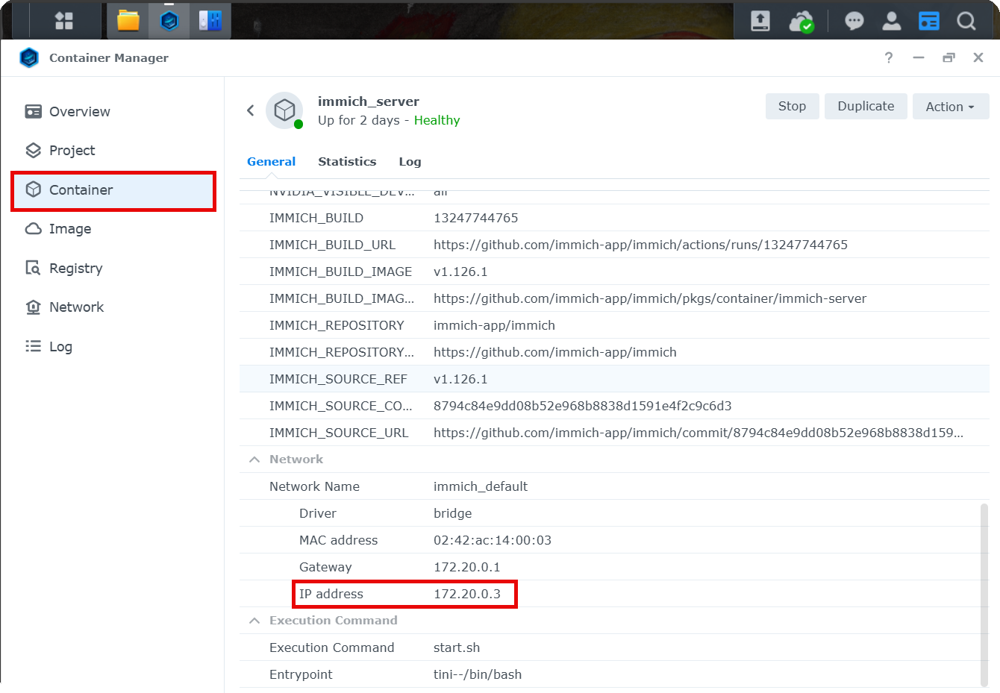
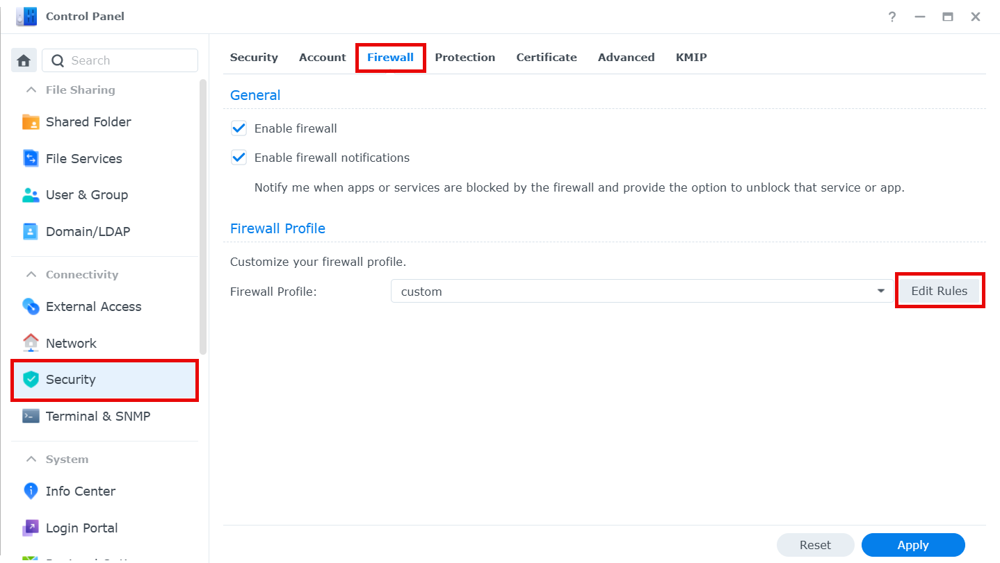

# Synology [Community]

:::note
This is a community contribution and not officially supported by the Immich team, but included here for convenience.

Community support can be found in the dedicated channel on the [Discord Server](https://discord.immich.app/).

**Please report app issues to the corresponding [Github Repository](https://github.com/truenas/charts/tree/master/community/immich).**
:::

Immich can easily be installed on a Synology NAS using Container Manager within DSM. If you have not installed Container Manager already, you can install it in the Packages Center. Refer to the [Container Manager docs](https://kb.synology.com/en-us/DSM/help/ContainerManager/docker_desc?version=7) for more information on using Container Manager.

## Step 1 - Download the required files

Create a directory of your choice (e.g. `./immich-app`) to house Immich. In general, it's a best practice to have all Docker-based applications running under the `./docker` directory, so in this case, your directory structure will look like `./docker/immich-app`.

Now create a `./postgres` and `./library` directory as sub-directories of the `./docker/immich-app`.

When you're all done, you should have the following:

- `./docker/immich-app/postgres`
- `./docker/immich-app/library`

Download [`docker-compose.yml`](https://github.com/immich-app/immich/releases/latest/download/docker-compose.yml) and [`example.env`](https://github.com/immich-app/immich/releases/latest/download/example.env) to your computer. Upload the files to the `./docker/immich-app` directory.

## Step 2 - Populate the .env file with custom values

Follow [Step 2 in Docker Compose](./docker-compose#step-2---populate-the-env-file-with-custom-values) for instructions on customizing the `.env` file, and then return back to this guide to continue.

## Step 3 - Create a new project in Container Manager

Open Container Manager, and select the "**Project**" action on the left navigation bar and then click "**Create**".

In the settings of your new project, set "**Project name**" to a name you'll remember, such as _immich-app_. When setting the "**Path**", select the `./docker/immich-app` directory you created earlier. Doing so will prompt a message to use the existing `docker-compose.yml` already present in the directory for your project. Click "**OK**" to continue.

The following screen will give you the option to further customize your `docker-compose.yml` file, giving you a warning regarding the `start_interval` property. Under the `healthcheck` heading, remove the `start_interval: 30s` completely and click "**Next**".

Skip the section asking to set-up a portal for Web Station, and then complete the wizard which will build and start the containers for your project.

Once your containers are successfully running, navigate to the "**Container**" section of Container Manager, right-click on the "**immich-server**" container, and choose the "**Details**".

Scroll to the bottom of the "**Details**" section, and find the `IP Address` of the container, located in the `Network` section. Take note of the container's IP address as you will need it for **Step 4**.

## Step 4 - Configure Firewall Settings

Once your project completes the build process, your containers will start. In order to be able to access Immich from your browser, you need to configure the firewall settings for your Synology NAS.

Open "**Control Panel**" on your Synology NAS, and select "**Security**". Navigate to "**Firewall**"

Click "**Edit Rules**" and add the following firewall rules:

- Add a "**Source IP**" rule for the IP address of your container that you obtained in Step 3 above
- Add a "**Ports**" rule for the port specified in the `docker-compose.yml`, which should be `2283`

## Next Steps

Read the [Post Installation](/docs/install/post-install.mdx) steps and [upgrade instructions](/docs/install/upgrading.md).
