import Tabs from '@theme/Tabs';
import TabItem from '@theme/TabItem';

# Synology [Community]

:::note
This is a community contribution and not officially supported by the Immich team, but included here for convenience.

Community support can be found in the dedicated channel on the [Discord Server](https://discord.immich.app/).

**Please report app issues to the corresponding [Github Repository](https://github.com/truenas/charts/tree/master/community/immich).**
:::

Immich can easily be installed on a Synology NAS using Container Manager within DSM. If you have not installed Container Manager already, you can install it in the Packages Center. Refer to the [Container Manager docs](https://kb.synology.com/en-us/DSM/help/ContainerManager/docker_desc?version=7) for more information on using Container Manager. If you wish to install Immich using Portainer on Synology, see [Marius Hosting](https://mariushosting.com/how-to-install-immich-on-your-synology-nas/) for more information.

## Step 1 - Download the required files

Create a directory of your choice (e.g. `./immich-app`) to house Immich. In general, it's best practice to have all Docker-based applications running under the `./docker` directory, so in this case, your directory structure will look like `./docker/immich-app`.

Now create a `./postgres` and `./library` directory as sub-directories of the `./docker/immich-app`.

When you're all done, you should have the following:

- `./docker/immich-app/postgres`
- `./docker/immich-app/library`

Download [`docker-compose.yml`](https://github.com/immich-app/immich/releases/latest/download/docker-compose.yml) and [`example.env`](https://github.com/immich-app/immich/releases/latest/download/example.env) to your computer. Upload the files to the `./docker/immich-app` directory, and rename `example.env` to `.env`. Note: If you plan to use the Synology Text editor to edit the `.env` file on the NAS within File Station, you will need to rename it to a temporary name (e.g. `example.txt`) in order to see 'Open with Text Editor' in the file context menu. Once saved, rename it back to `.env`.

## Step 2 - Populate the .env file with custom values

Follow [Step 2 in Docker Compose](/docs/install/docker-compose#step-2---populate-the-env-file-with-custom-values) for instructions on customizing the `.env` file, and then return back to this guide to continue.

## Step 3 - Create a new project in Container Manager

Open Container Manager, and select the "**Project**" action on the left navigation bar and then click "**Create**".

In the settings of your new project, set "**Project name**" to a name you'll remember, such as _immich-app_. When setting the "**Path**", select the `./docker/immich-app` directory you created earlier. Doing so will prompt a message to use the existing `docker-compose.yml` already present in the directory for your project. Click "**OK**" to continue.

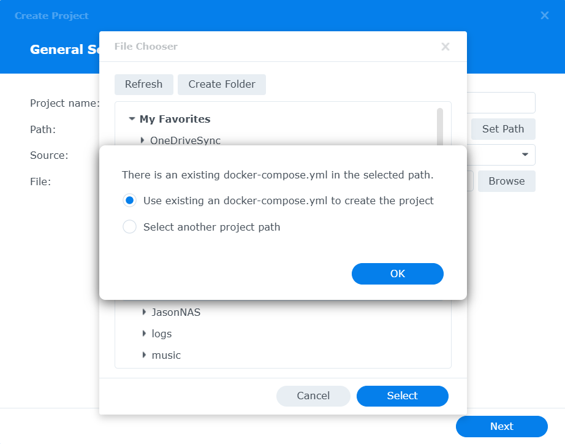

The following screen will give you the option to further customize your `docker-compose.yml` file. Take note of `DB_STORAGE_TYPE: 'HDD'`and uncomment if applicable for your Synology setup.

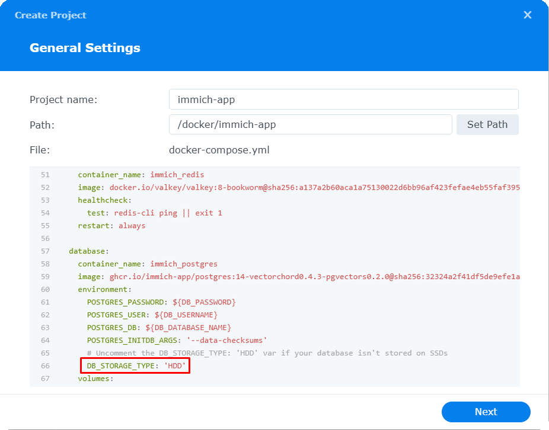

Skip the section asking to set-up a portal for Web Station, and then complete the wizard which will build and start the containers for your project.

Once your containers are successfully running, navigate to the "**Container**" section of Container Manager, right-click on the "**immich-server**" container, and choose the "**Details**".

Scroll to the bottom of the "**Details**" section, and find the `IP Address` of the container, located in the `Network` section. Take note of the container's IP address as you will need it for **Step 4**.

## Step 4 - Configure Firewall Settings

Once your project completes the build process, your containers will start. In order to be able to access Immich from your browser, you need to configure the firewall settings for your Synology NAS.

Open "**Control Panel**" on your Synology NAS, and select "**Security**". Navigate to "**Firewall**"

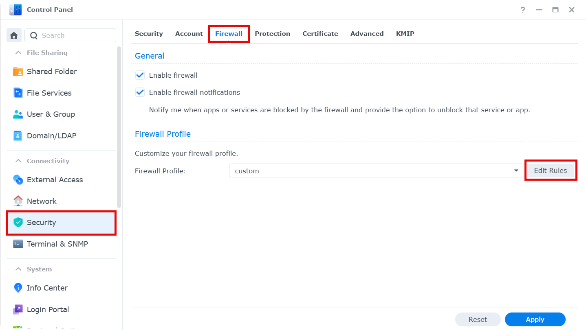

Click "**Edit Rules**" and add the following firewall rules:

- Add a "**Source IP**" rule for the IP address of your container that you obtained in Step 3 above
  
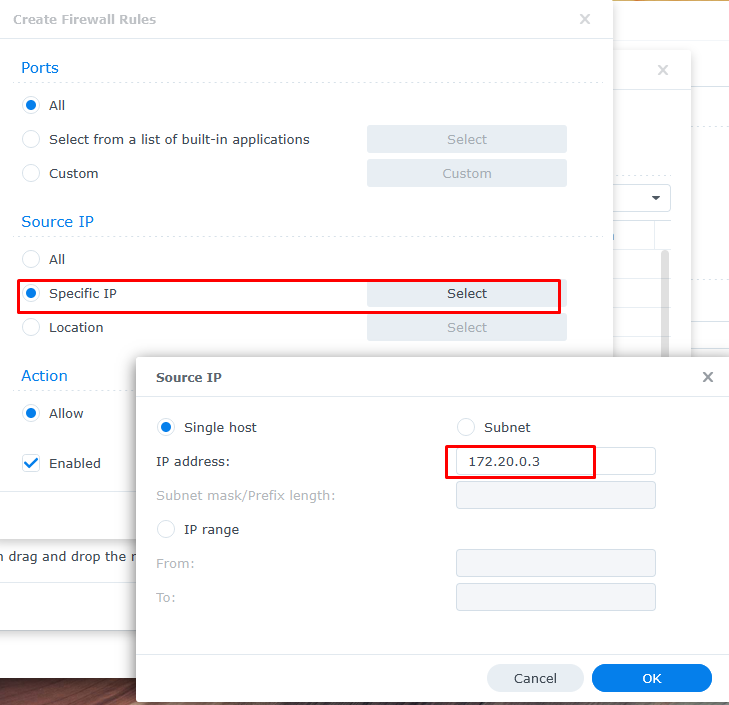

- Add a "**Ports**" rule for the port specified in the `docker-compose.yml`, which should be `2283`
  
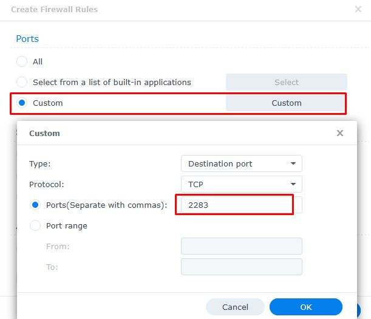

## Next Steps

Read the [Post Installation](/docs/install/post-install.mdx) steps and [upgrade instructions](/docs/install/upgrading.md).

## Upgrading Immich using Container Manager

  
Updating Immich using Container Manager

Ensure to review the post installation and general upgrade instructions above before proceeding with this section.

## Step 1. Backup
Ensure your photos and videos are backed up. Your `.env` settings will define where they are stored. It is recommended you maintain a copy of your current `docker-compose.yml` and `.env` files so that you can compare them with the newer release files. There is no need to delete any files or folders within the `docker` folder when doing a release upgrade unless instructed in the release notes, or you know what you are doing.

## Step 2. Check release notes
We recommend you always check the [release notes](https://github.com/immich-app/immich/releases) before proceeding with an upgrade.

## Step 3. Download files
Download the latest versions of [docker-compose.yml](https://github.com/immich-app/immich/releases/latest/download/docker-compose.yml) and [example.env.](https://github.com/immich-app/immich/releases/latest/download/example.env) from Github. If you want to upgrade to a release prior to the latest, go to the [Immich releases page](https://github.com/immich-app/immich/releases), and scroll down to find the required release and associated files.

During a release upgrade, `.env` usually does not change unless specified in the release notes. Likewise, depending on what releases you are moving between, there may be no changes to `docker-compose.yml` either. Using a text comparison tool is useful to see any changes.

## Step 4. Stop containers & clean up
Open `Container Manager`. Select `Project`, select your Immich app and click `Stop`. 

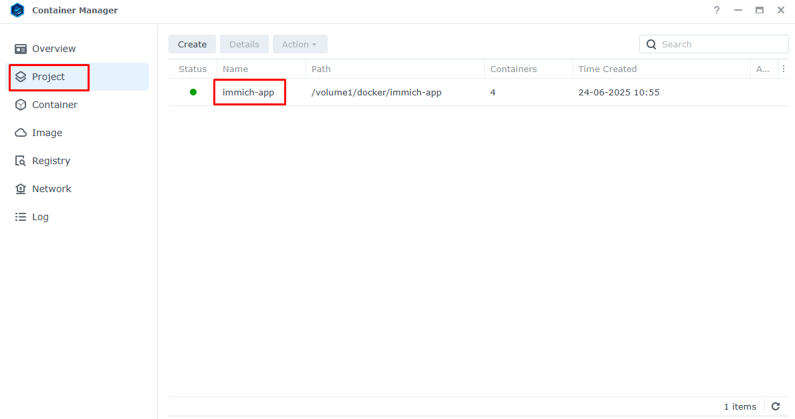

Select `Action` and `Clean`. This removes the containers.

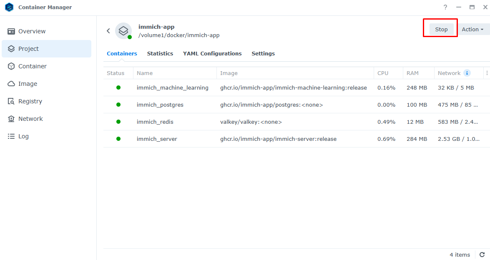

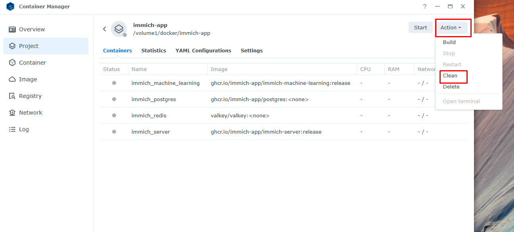

Go to the `Image` section, and select `Remove Unused Images`.
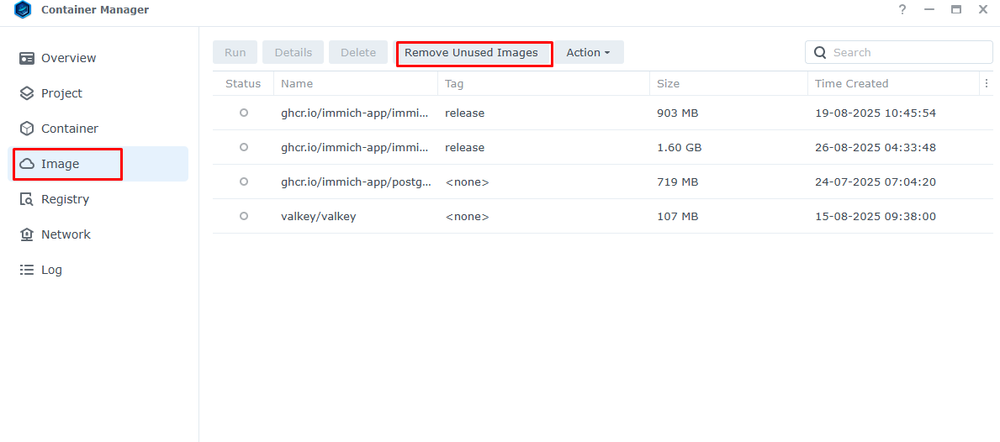

## Step 5. Build
If you need to upload a new `docker-compose.yml` and/or `.env`, upload to overwrite the existing files under the `docker` folder using Synology File Station, and check whether you need to un-comment `# DB_STORAGE_TYPE:'HDD'` in `docker-compose.yml` for your NAS setup. 

After finishing the cleanup and any uploads, go to the `Project` section, select `Action` then `Build`. This will download, unpack, install and start the containers.

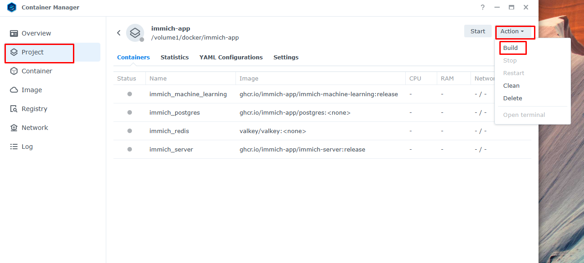

## Step 6. Update firewall rule
The default option is to automatically start the containers once installed. This can cause `immich_server` to run for a few seconds and stop/restart with errors because the firewall rule no longer matches the server IP address.

Go to the `Container` section. Click on `immich_server` and scroll down on the `General` section to find the IP address. It will be something like 172.x.0.x

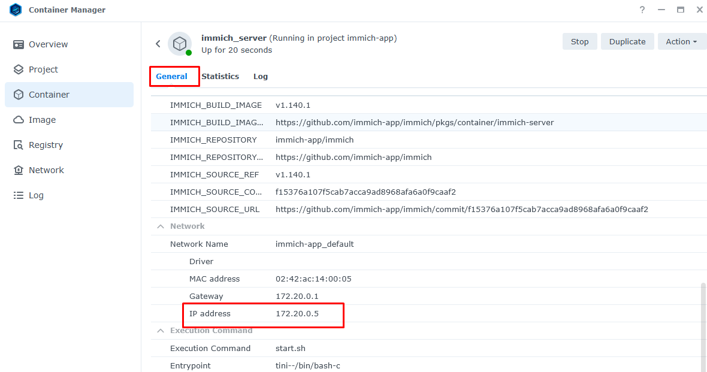

Go to Synology `Control Panel`. Click on `Security` and select  `Firewall`.

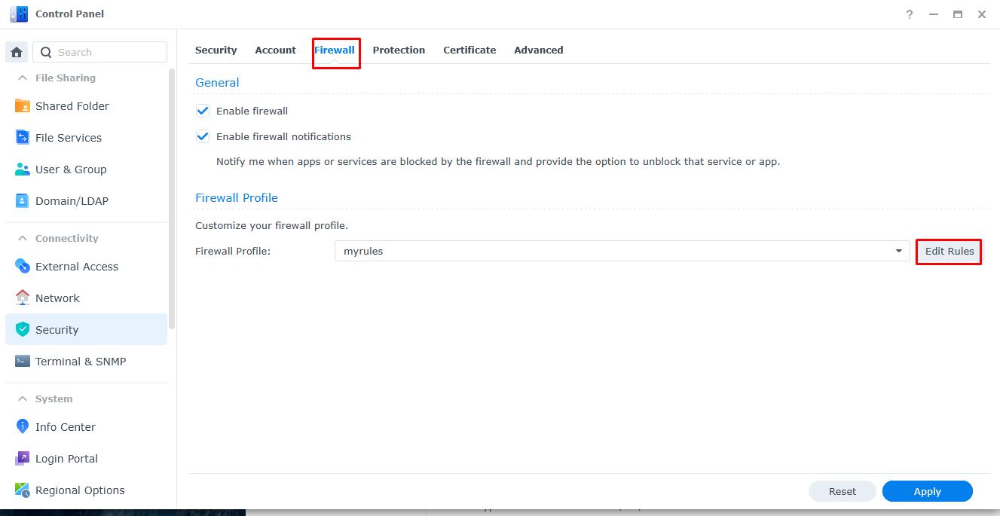

Check/edit the firewall rule to match above.

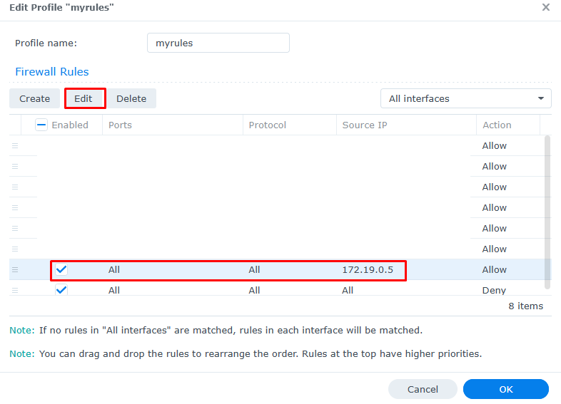

