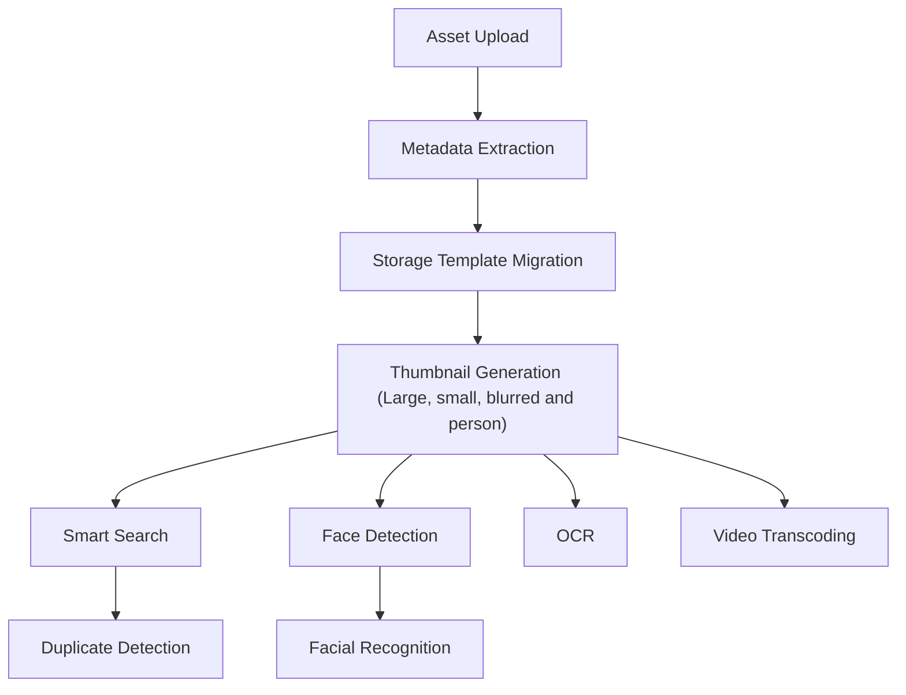

# Jobs

Immich performs most of its work in background jobs, each with its own queue. The queues are visible at `Administration > Job Queues`, where they can be watched and manually triggered.

Jobs run on the `microservices` [worker](/reference/workers), and each queue is processed in order. The **Actions** listed for each job are defined under [Running a job manually](#running-a-job-manually).

## Extract metadata

Reads metadata from each asset — date, GPS, camera, dimensions, faces, and tags. See [EXIF tags](/reference/exif-tags) for every tag involved and which feature each one drives.

**Actions:** All, Missing

## Generate Thumbnails

Generates large, small, and blurred thumbnails for each asset, as well as a thumbnail for each person.

**Actions:** All, Missing

## Transcode videos

Transcodes videos for wider compatibility with browsers and devices, according to the transcode policy in the video transcoding settings. The original file is never replaced.

**Actions:** All, Missing

## Smart Search

Runs the [CLIP model](/reference/clip-models) over each asset to produce the embeddings that power contextual search.

**Actions:** All, Missing — requires machine learning to be enabled

## Face detection

Detects the faces in assets using machine learning. For videos, only the thumbnail is considered. Detected faces are queued for Facial Recognition once detection completes.

**Actions:** Reset, Refresh, Missing — requires machine learning to be enabled

## Facial Recognition

Groups detected faces into people. This step runs after Face detection is complete. See [Facial recognition](/concepts/facial-recognition) for how the clustering works.

**Actions:** Reset, Missing — requires machine learning to be enabled

## OCR

Uses machine learning to recognize text in images so that it can be searched.

**Actions:** All, Missing — requires machine learning to be enabled

## Duplicate Detection

Detects visually similar assets. Relies on the embeddings produced by Smart Search. See [Duplicate detection](/concepts/duplicate-detection).

**Actions:** All, Missing — requires machine learning to be enabled

## Sidecar metadata

Discovers and synchronizes [XMP sidecar](/reference/xmp-sidecars) files on the filesystem. The same queue runs Sidecar Write, which writes edited metadata back out to the sidecar.

**Actions:** Sync, Discover

## External Libraries

Scans [external libraries](/concepts/external-libraries) for new and changed assets, and cleans up libraries that are stuck in deletion.

**Actions:** Rescan

## Storage template migration

Moves existing files to match the current [storage template](/administration/use-the-storage-template). Only needed after changing the template; new assets are placed correctly on upload.

**Actions:** Start

## Migration

Moves thumbnails for assets and faces to the latest folder structure.

**Actions:** Start

## Processing order

Jobs are queued in a fixed order, with later jobs depending on the output of earlier ones. Uploading an asset runs the following:

Thumbnail generation is the fan-out point: Smart Search, Face detection, OCR, and video transcoding all wait for it, because they operate on the generated preview rather than the original. Duplicate Detection then depends on Smart Search, and Facial Recognition on Face detection.

## Running a job manually

Each queue offers some combination of the following actions:

| Action                  | Effect                                                                          |
| ----------------------- | ------------------------------------------------------------------------------- |
| **All**                 | Queues every asset, reprocessing assets that already have a result.             |
| **Missing**             | Queues only assets that have not been processed yet.                            |
| **Refresh**             | Reprocesses all assets without discarding existing data first.                  |
| **Reset**               | Clears existing results and reprocesses everything.                             |
| **Sync** / **Discover** | Synchronizes metadata from known sidecar files, or discovers new sidecar files. |
| **Rescan**              | Rescans external libraries for changes.                                         |
| **Start**               | Begins a one-off migration.                                                     |

Resetting face data is destructive — it discards all detected faces, and people have to be rebuilt by Facial Recognition.

## Concurrency

Each job's concurrency is set independently at `Administration > Settings > Job Settings`, and the defaults are listed under `job` in the [config file reference](/reference/config-file#default-configuration). Video transcoding and the machine learning jobs are the most resource-intensive, which is why their defaults are lower than the rest.

## Jobs configured elsewhere

Some scheduled work does not appear on the Job Queues page:

- **Nightly tasks** — memory generation, database cleanup, missing thumbnails, and face clustering. These run every night at midnight by default; the schedule and which tasks run are set under [Nightly Tasks Settings](https://my.immich.app/admin/system-settings?isOpen=nightly-tasks).

  

- **Database backups** — see [Backups](/concepts/backups).
- **External library scanning** — the periodic scan interval is configured per library, not on the queue page.
- **Integrity checks** — see [System Integrity](/concepts/system-integrity).
