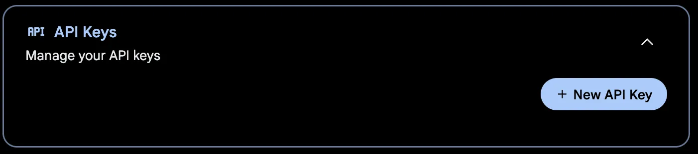
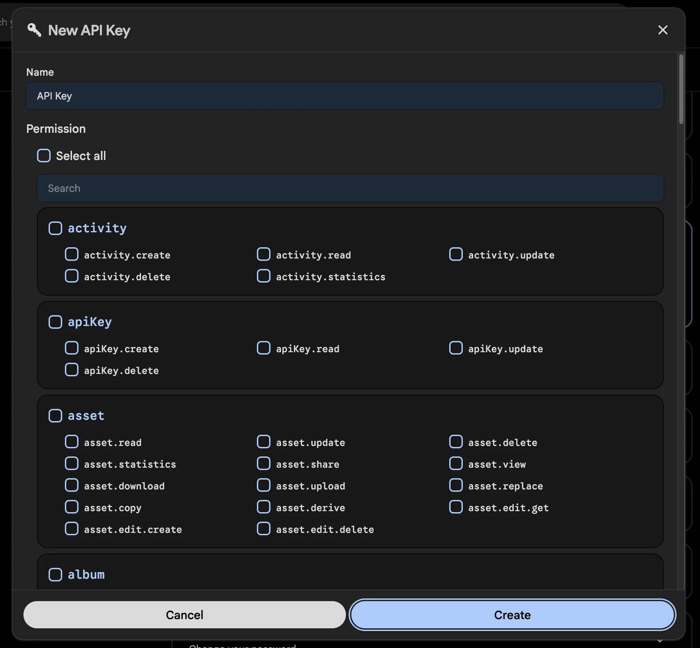

# Upload media with the CLI

This guide covers uploading photos and videos to Immich from a terminal with the [Immich CLI](/reference/immich-cli). Install it first, then come back here.

:::tip Google Photos Takeout
If you are looking to import your Google Photos takeout, we recommend this community maintained tool [immich-go](https://github.com/simulot/immich-go).
:::

## Obtain an API key

The API key can be obtained in the user setting panel on the web interface. You can also specify permissions for the key to limit its access.





## Authenticate

Log in with your server URL and API key:

```bash
# immich login [url] [key]
immich login http://192.168.1.216:2283/api HFEJ38DNSDUEG
```

This stores your credentials in an `auth.yml` file in the configuration directory, which defaults to `~/.config/immich/`. The directory can be set with the `-d` option or the environment variable `IMMICH_CONFIG_DIR`. Keep the file secure, either by running `immich logout` when you are done or by deleting it manually.

## Upload individual files

```bash
immich upload file1.jpg file2.jpg
```

## Upload a directory and its subfolders

By default, subfolders are not included. To upload a directory including subfolders, use the `--recursive` option:

```bash
immich upload --recursive directory/
```

## Preview what would happen

If you are unsure what will happen, use the `--dry-run` option to see what would be uploaded without actually performing any actions:

```bash
immich upload --dry-run --recursive directory/
```

## Skip hashing to upload faster

By default, the upload command hashes files before uploading them to avoid uploading the same file multiple times. If you are sure that the files are unique, you can skip this step with `--skip-hash`. Immich always performs its own deduplication through hashing, so this is merely a performance consideration — if you have good bandwidth it might be faster to skip hashing.

```bash
immich upload --skip-hash --recursive directory/
```

## Create albums from folder names

`--album` creates an album for each uploaded asset based on the name of the folder it is in:

```bash
immich upload --album --recursive directory/
```

To put everything into one specific album instead, use `--album-name`:

```bash
immich upload --album-name "My summer holiday" --recursive directory/
```

## Skip files matching a pattern

`--ignore` skips assets matching a glob pattern. See [Exclusion patterns](/reference/exclusion-patterns) for how to write glob patterns. You can add several exclusion patterns if needed.

```bash
immich upload --ignore **/Raw/** --recursive directory/
```

```bash
immich upload --ignore **/Raw/** **/*.tif --recursive directory/
```

## Include hidden files

By default, hidden files are skipped:

```bash
immich upload --include-hidden --recursive directory/
```

## Set the visibility of uploaded assets

You can set the visibility of uploaded assets to `archive`, `timeline`, `hidden`, or `locked`:

```bash
immich upload --visibility archive --recursive directory/
```

## Post-process the results as JSON

The `--json-output` option prints JSON with three keys: `newFiles`, `duplicates` and `newAssets`. Due to some logging output you need to strip the first few lines of output to get at the JSON. For example, to get a list of files that would be uploaded for further processing:

```bash
immich upload --dry-run --json-output . | tail -n +6 | jq .newFiles[]
```

## Run the CLI from Docker

If npm is not available on your system, you can use the Docker image instead:

```bash
docker run -it -v "$(pwd)":/import:ro -e IMMICH_INSTANCE_URL=https://your-immich-instance/api -e IMMICH_API_KEY=your-api-key ghcr.io/immich-app/immich-cli:latest
```

Modify the `IMMICH_INSTANCE_URL` and `IMMICH_API_KEY` environment variables as appropriate. You can also use a Docker env file to store your sensitive API key.

This `docker run` command runs the `immich` command inside the container, so you can append the desired parameters directly to the command line:

```bash
docker run -it -v "$(pwd)":/import:ro -e IMMICH_INSTANCE_URL=https://your-immich-instance/api -e IMMICH_API_KEY=your-api-key ghcr.io/immich-app/immich-cli:latest upload -a -c 5 --recursive directory/
```
