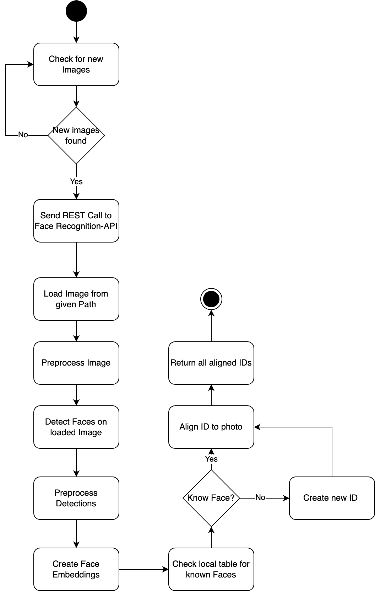

## Abstract
For a better organization of self captured photos, it would be helpful to know which person is on a photo and on which photos is this person.
Having this information, it would be possible to automatically create albums and collections of a specific group of people.
To reach that goal, another machine learning based service should be added to the Immich backend, that is able to recognize faces and identify them.

## Goals
The main goal of the enhancement is to enable face recognition and identifaction across Immich application. The key aspects of the final version should be:
- Fast, memory efficient face detection and identifaction process
- Should fit seamlessly into the existing architecture
- Create an Python based backend to showcase how to add other python based extensions that would enable more intelligent features (Python is the way to go for machine learning)
- Fully encapsulates the new service and use existing tagging functionality. 
- 
## Proposed Procedure

### Assumnptions:
- Image folder exposed to the Face Recognition Service
- The FaceRecognition service uses a database for facial reidentifaction (DB has to be selected, probably mongo db or other NoSQL database)

### Steps
1. New found images are queued by the microservice controller and are being sent to different machine learning services
2. As one of the machine learning apis, the face recognition api receives the image path and loads the image.
3. The image is being preprocessed to match the neural net requirment.
4. A face detector looking for faces in the images, crop the faces out.
5. An encoding network preprocess the crops and create embeddings of the faces.
6. For each found face / created embedding, the application checks whether a similiar face already exists. If one is existent, the proper ID will be assigned. Otherwise a new database entry is created.
7. Return all found face IDs to the controller via HTTP Response.

### Challenges
- Create an application which is able to run also on low-power devices to ensure a maximum of compatibility.
- Fulfill the previous point but also reach high accuracy by using SOTA techniques

### Tech-Stack
- Python 3.9
- Pytorch
- FastAPI
- Pillow
- Torchvision
- Numpy