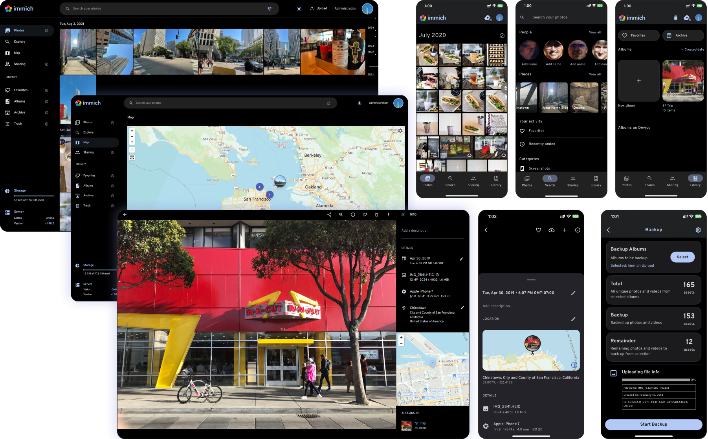

 
     
  
  
     
      

<h3 align="center">Високопроизводително самостоятелно хоствано решение за управление на снимки и видеа</h3>
 

 

  <a href="../README.md">English</a>
  <a href="README_ca_ES.md">Català</a>
  <a href="README_es_ES.md">Español</a>
  <a href="README_fr_FR.md">Français</a>
  <a href="README_it_IT.md">Italiano</a>
  <a href="README_ja_JP.md">日本語</a>
  <a href="README_ko_KR.md">한국어</a>
  <a href="README_de_DE.md">Deutsch</a>
  <a href="README_nl_NL.md">Nederlands</a>
  <a href="README_tr_TR.md">Türkçe</a>
  <a href="README_zh_CN.md">简体中文</a>
  <a href="README_zh_TW.md">正體中文</a>
  <a href="README_uk_UA.md">Українська</a>
  <a href="README_ru_RU.md">Русский</a>
  <a href="README_pt_BR.md">Português Brasileiro</a>
  <a href="README_sv_SE.md">Svenska</a>
  <a href="README_ar_JO.md">العربية</a>
  <a href="README_vi_VN.md">Tiếng Việt</a>
  <a href="README_th_TH.md">ภาษาไทย</a>

> [!WARNING]
> ⚠️ Винаги следвайте [плана за резервно копие 3-2-1](https://www.backblaze.com/blog/the-3-2-1-backup-strategy/) за вашите ценни снимки и видеа!
>

> [!NOTE]
> Основната документация, включително ръководства за инсталиране, е на [https://immich.app/](https://immich.app/).

## Връзки

- [Документация](https://docs.immich.app)
- [За проекта](https://docs.immich.app/overview/introduction)
- [Инсталиране](https://docs.immich.app/install/requirements)
- [Пътна карта](https://immich.app/roadmap)
- [Демо](#демо)
- [Функции](#функции)
- [Преводи](https://docs.immich.app/developer/translations)
- [Принос към проекта](https://docs.immich.app/overview/support-the-project)

## Демо

Достъп до демото [тук](https://demo.immich.app). За мобилното приложение използвайте `https://demo.immich.app` като `Server Endpoint URL`.

### Данни за вход

| Имейл           | Парола |
| --------------- | ------ |
| demo@immich.app | demo   |

## Функции

| Функции                                                   | Мобилно | Уеб |
| :-------------------------------------------------------- | ------- | --- |
| Качване и преглед на видеа и снимки                       | Да      | Да  |
| Автоматично резервно копие при отваряне на приложението   | Да      | N/A |
| Предотвратяване на дублиране на файлове                   | Да      | Да  |
| Избор на албум(и) за резервно копие                       | Да      | N/A |
| Изтегляне на снимки и видеа на локалното устройство       | Да      | Да  |
| Поддръжка на множество потребители                        | Да      | Да  |
| Албуми и споделени албуми                                 | Да      | Да  |
| Интерактивен плъзгач за превъртане                        | Да      | Да  |
| Поддръжка на RAW формати                                  | Да      | Да  |
| Преглед на метаданни (EXIF, карта)                        | Да      | Да  |
| Търсене по метаданни, обекти, лица и CLIP                 | Да      | Да  |
| Административни функции (управление на потребители)       | Не      | Да  |
| Фоново резервно копие                                     | Да      | N/A |
| Виртуално превъртане                                      | Да      | Да  |
| Поддръжка на OAuth                                        | Да      | Да  |
| API ключове                                               | N/A     | Да  |
| Резервно копие и възпроизвеждане на LivePhoto/MotionPhoto | Да      | Да  |
| Поддръжка на 360-градусови изображения                    | Не      | Да  |
| Потребителска структура на съхранение                     | Да      | Да  |
| Публично споделяне                                        | Да      | Да  |
| Архив и любими                                            | Да      | Да  |
| Глобална карта                                            | Да      | Да  |
| Споделяне с партньор                                      | Да      | Да  |
| Разпознаване и групиране на лица                          | Да      | Да  |
| Спомени (преди x години)                                  | Да      | Да  |
| Офлайн поддръжка                                          | Да      | Не  |
| Галерия само за четене                                    | Да      | Да  |
| Подредени снимки                                          | Да      | Да  |
| Тагове                                                    | Не      | Да  |
| Преглед по папки                                          | Да      | Да  |

## Преводи

Повече за преводите [тук](https://docs.immich.app/developer/translations).

## Активност в хранилището

## История на звездите

<a href="https://star-history.com/#immich-app/immich&Date">
 <picture>
   <source media="(prefers-color-scheme: dark)" srcset="https://api.star-history.com/svg?repos=immich-app/immich&type=Date&theme=dark" />
   <source media="(prefers-color-scheme: light)" srcset="https://api.star-history.com/svg?repos=immich-app/immich&type=Date" />
   
 </picture>
</a>

## Сътрудници

