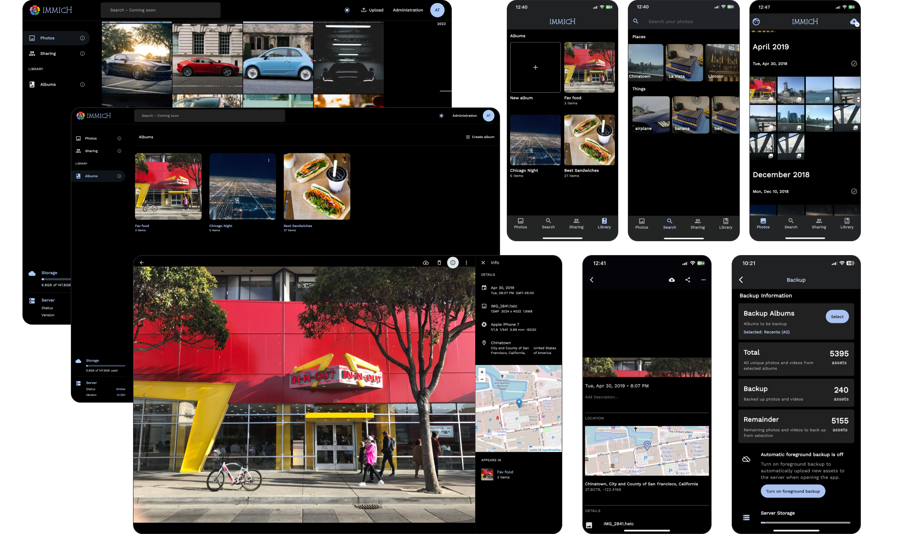

<p align="center"> 
  <br/>  
  <a href="https://opensource.org/license/agpl-v3"></a>
  <a href="https://discord.gg/D8JsnBEuKb">
    
  </a>
  <br/>  
  <br/>   
</p>

<p align="center">

</p>
<h3 align="center">Immich - Высокопроизводительное решение для автономоного создания фото и видео архивов</h3>
<br/>
<a href="https://immich.app">

</a>
<br/>
<p align="center">
  <a href="../README.md">English</a>
  <a href="README_ca_ES.md">Català</a>
  <a href="README_es_ES.md">Español</a>
  <a href="README_fr_FR.md">Français</a>
  <a href="README_it_IT.md">Italiano</a>
  <a href="README_ja_JP.md">日本語</a>
  <a href="README_ko_KR.md">한국어</a>
  <a href="README_de_DE.md">Deutsch</a>
  <a href="README_nl_NL.md">Nederlands</a>
  <a href="README_tr_TR.md">Türkçe</a>
  <a href="README_zh_CN.md">中文</a>
  <a href="README_ru_RU.md">Русский</a>
  <a href="README_pt_BR.md">Português Brasileiro</a>
  <a href="README_sv_SE.md">Svenska</a>
  <a href="README_ar_JO.md">العربية</a>
</p>

## Предупреждение

- ⚠️ Этот проект находится **в очень активной** разработке.
- ⚠️ Ожидайте ошибок и критических изменение.
- ⚠️ **Не используйте это приложение для бекапа ваших фото и видео.**
- ⚠️ Всегда следуйте [3-2-1](https://www.backblaze.com/blog/the-3-2-1-backup-strategy/) плану резервного копирования ваших драгоценных фото и видео!

## Содержание

- [Официальная документация](https://immich.app/docs)
- [План разработки](https://github.com/orgs/immich-app/projects/1)
- [Демо](#demo)
- [Возможности](#features)
- [Введение](https://immich.app/docs/overview/introduction)
- [Инсталяция](https://immich.app/docs/install/requirements)
- [Гайд по доработке проекта](https://immich.app/docs/overview/support-the-project)

## Документация

Вы можете найти основную документация, включая инструкции по установке по ссылке https://immich.app/.

## Демо

Вы можете посмотреть  веб демо по ссылке https://demo.immich.app

Для мобильного приложения вы можете использовать адрес `https://demo.immich.app/api` в поле `Server Endpoint URL`

```bash title="Демо доступ"
Реквизиты доступа
логин/почта: demo@immich.app
пароль: demo
```

```
Spec: Free-tier Oracle VM - Amsterdam - 2.4Ghz quad-core ARM64 CPU, 24GB RAM
```

## Возможности

| Возможности                                         | Приложение | Веб |
| --------------------------------------------------- | ---------- | --- |
| Выгрузка на сервер и просмотр видео и фото          | Да         | Да  |
| Авто бекап когда приложение открыто                 | Да         | Н/Д |
| Выбор альбома(ов) для бекапа                        | Да         | Н/Д |
| загрузка с сервера фото и видео на устройство       | Да         | Да  |
| Поддержка нескольких пользователей                  | Да         | Да  |
| Альбомы и общие альбомы                             | Да         | Да  |
| Прокручиваемая/перетаскиваемая полоса прокрутки     | Да         | Да  |
| Поддержка формата RAW                               | Да         | Да  |
| Просмотр метаданных (EXIF, map)                     | Да         | Да  |
| Поиск до метаданным, объектам, лицам и CLIP         | Да         | Да  |
| Административные функци (управление пользователями) | Нет        | Да  |
| Фоновый бекпа                                       | Да         | Н/Д |
| Виртуальная прокрутка                               | Да         | Да  |
| Поддержка OAuth                                     | Да         | Да  |
| Ключи API                                           | Н/Д        | Да  |
| LivePhoto/MotionPhoto бекап и воспроизведение       | Да         | Да  |
| Настраиваемая структура хранилища                   | Да         | Да  |
| Публичные альбомы                                   | Нет        | Да  |
| Архив и Избранное                                   | Да         | Да  |
| Мировая карта                                       | Да         | Да  |
| Совместное использование                            | Да         | Да  |
| Распознавание лиц и группировка по лицам            | Да         | Да  |
| В этот день (x лет назад)                           | Да         | Да  |
| Работа без интернета                                | Да         | Нет |
| Галлереи только для просмотра                       | Да         | Да  |
| Колллажи                                            | Да         | Да  |

## Авторы
<a href="https://github.com/alextran1502/immich/graphs/contributors">
  
</a>
